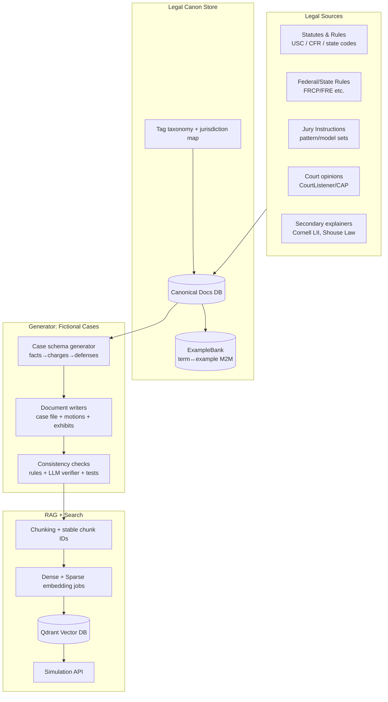
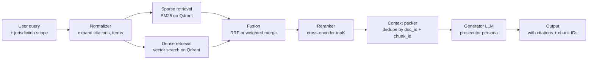
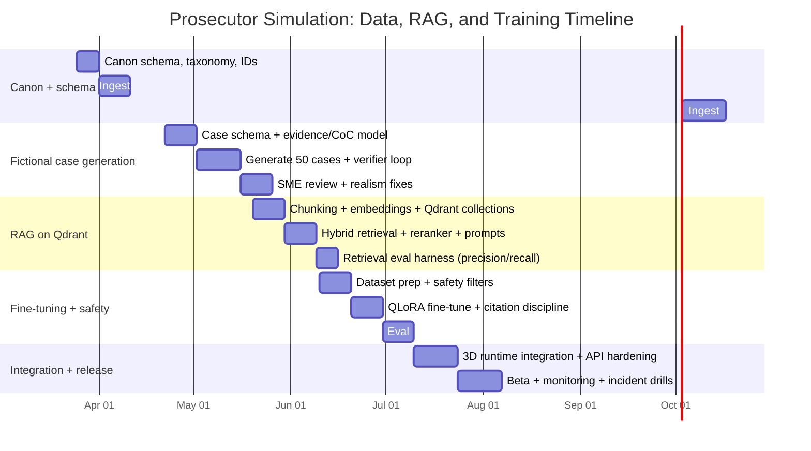

# Building a 3D Prosecutor Simulation With Fictional Cases and High-Fidelity Legal Realism

## Executive summary

A realistic “prosecutor” simulation (entity["video_game","Phoenix Wright: Ace Attorney","capcom courtroom game"]–style) that feels legally authentic requires treating **legal content as a governed corpus** (statutes, rules, jury instructions, case law exemplars) while ensuring **all playable cases remain fictional** and **jurisdiction-scoped**. In practice, you want two intertwined systems:

A. A **legal-content pipeline + data model** that (1) ingests authoritative legal materials (primary sources first), (2) generates *fictional* case files that are internally consistent with those authorities (facts → charges → elements → instructions → admissibility issues), and (3) publishes every unit of content with stable IDs, provenance, and jurisdiction tags suitable for retrieval and training.

B. An **ML/engineering stack** that builds a hybrid retrieval system (BM25 + dense embeddings) on entity["company","Qdrant","vector database"], plus a fine-tuning workflow (LoRA/QLoRA) that distills your prosecutor persona into a model that is **citation-faithful**, **jurisdiction-aware**, and **hallucination-resistant** (with explicit evaluation gates). Qdrant explicitly supports payload metadata, filtering, named vectors, sparse vectors (for lexical retrieval), and hybrid retrieval patterns. citeturn6search7turn6search11turn8search4turn0search4turn0search17

For legal data sources and licensing: bulk caselaw from entity["organization","CourtListener","legal data platform"] / entity["organization","Free Law Project","open legal data nonprofit"] is published as “free of known copyright restrictions,” which is a strong foundation for a shareable ExampleBank. citeturn1search0turn1search4 The entity["organization","Caselaw Access Project","harvard lil project"] dataset is available under CC0 (including on entity["company","Hugging Face","ml model hub"]). citeturn1search1turn1search9 However, secondary sources like entity["organization","Legal Information Institute","cornell law school"] pages are copyrighted compilations, and entity["organization","Shouse Law Group","law firm california us"] imposes reuse constraints (commonly non-commercial) and includes disclaimers. citeturn2search26turn2search9 Finally, entity["book","Black's Law Dictionary","garner 2024 12th ed"] is a useful benchmark but is copyrighted commercial content; treat it as a reference target, not a dataset to copy. citeturn7search4turn7search0

## System scope and high-level architecture

### Assumptions

This design assumes:

- Web app: React-based UI (per your requirement), with SSR optional (e.g., Next.js-style behavior if you later adopt it).
- 3D engine: unspecified (could be Three.js/Babylon.js/Unity WebGL), so the design treats 3D as a client that consumes “scene scripts” + “dialogue turns” + “evidence interactions” from an API.
- Jurisdiction: default U.S. common-law focus, with **explicit jurisdiction tags** (US-FED, CA, NY, etc.) for every authoritative snippet and every fictional case.
- No budget constraint: design favors “correct-by-design” governance (provenance, licensing logs, evaluation gates) rather than the cheapest implementation.

### Why a governed corpus is non-negotiable for “legal realism”

“Legal realism” in a simulation is less about writing fancy dialogue and more about **consistency with controlling authority**:

- Procedure and admissibility must align with an identified rule set (e.g., FRE relevance test). citeturn7search2turn7search6
- Injunction/TRO patterns and required showings should follow known procedural rules when you simulate civil remedies. citeturn7search3turn7search19
- Case law exemplars should be sourced from public-domain / open-licensed corpora and cited in a consistent manner.

You indicated you already have a substantial SCOTUS-focused opinion corpus embedded in PostgreSQL (per your uploaded note at `/mnt/data/Pasted text.txt`). That can seed early “case law exemplars,” but the system described below generalizes to state/federal expansion.

### Architectural overview



The most important product-level property is: **every generated statement that claims “the law is X” must either (a) cite a canonical chunk, or (b) be marked as fictional narrative**.

## Deliverable A: Legal-content pipeline and data model for fictional cases

### Legal sourcing policy

#### Authority levels

Adopt a controlled authority ladder that is explicit in metadata and enforced in prompt templates:

- **Primary / controlling** (highest): statutes, regulations, rules, binding court opinions, officially published jury instructions.
- **Persuasive**: non-binding opinions, treatises, official agency guidance, circuit pattern instructions (where not binding but influential).
- **Secondary** (lowest): Cornell LII explanations, Shouse Law explainers, blogs.

CourtListener publishes bulk legal data and states its bulk files are “free of known copyright restrictions.” citeturn1search0 CAP data is CC0 via case.law and Hugging Face dataset cards. citeturn1search9turn1search1

When consuming secondary sources, track licensing separately: Cornell’s LII terms emphasize their compilation/pages are protected by copyright and that online distribution is not consent for commercial redistribution. citeturn2search26 Shouse Law’s policies/disclaimers describe (a) no legal advice and (b) constraints on reuse (commonly non-commercial, check the exact terms you operate under). citeturn2search9turn2search1

#### Case law “public domain” nuance you must encode in policy

In the U.S., the “government edicts doctrine” principle is that “no one can own the law,” and the Supreme Court has framed limits and distinctions around official legal materials versus publisher-created enhancements. This is central when you ingest case opinions and avoid copyrighted editorial layers (e.g., proprietary headnotes). citeturn1search7

### Core data model

You want *two* parallel universes of content:

- **Legal Canon**: real laws and real opinions, heavily cited and jurisdiction-tagged.
- **Fictional Universe**: fictional cases that *reference* canon chunks, but whose parties and facts are invented.

A minimal-but-scalable schema (relational or document) is below. Field names are illustrative, not mandatory.

#### Canonical documents

**Table: `canonical_documents`**
- `doc_id` (UUID, stable)
- `doc_type` (enum): `statute`, `rule`, `jury_instruction`, `opinion`, `agency_opinion`, `secondary_explainer`
- `title`
- `jurisdiction_tags[]` (e.g., `US-FED`, `CA`)
- `authority_level` (enum): `primary`, `persuasive`, `secondary`
- `source_url`
- `citation` (e.g., “Fed. R. Evid. 401”)
- `publisher` (e.g., “GovInfo”, “CourtListener”, “case.law”, “Cornell LII”)
- `license_tag` (enum): `public_domain`, `cc0`, `unknown`, `all_rights_reserved`, `noncommercial_only`, etc.
- `retrieved_at`, `source_last_updated_at` (when obtainable)
- `raw_text` (or object storage pointer)

For FRE relevance, you can store the canonical rule text and cite its source; Cornell’s Rule 401 page provides the relevance test. citeturn7search2 (For high rigor, also store official PDFs from uscourts.gov/govinfo when available; they are often more stable references. citeturn7search18turn7search22)

#### Chunk store + chunk IDs

**Table: `canonical_chunks`**
- `chunk_id` (stable; see chunk ID strategy below)
- `doc_id` (FK)
- `chunk_index` (int)
- `char_start`, `char_end`
- `text`
- `semantic_label` (short model-generated label, e.g., “FRE 401 relevance definition”)
- `jurisdiction_tags[]`
- `authority_level`
- `citations[]` (structured list; often one, sometimes multiple)
- `provenance` (hash + retrieval timestamp)
- `distilled_tags[]` (domain, concepts, who/what/why/how, etc.)

#### Glossary terms + ExampleBank (term↔example M2M)

**Table: `terms`**
- `term_id` (UUID)
- `term`
- `part_of_speech`
- `domain_tags[]` (criminal, tort, evidence, etc.)
- `jurisdiction_tags[]`
- `definition_plain`
- `definition_formal`
- `authority_level` of definition (often secondary for phrasing, but linked to primary citations)
- `canonical_citation_chunk_ids[]` (FK to `canonical_chunks`)
- `created_at`, `updated_at`

**Table: `examples`**
- `example_id` (UUID)
- `example_type` (enum): `statute_snippet`, `rule_snippet`, `case_snippet`, `jury_instruction_snippet`, `fictional_fact_pattern`, `fictional_dialogue_turn`
- `text`
- `jurisdiction_tags[]`
- `authority_level`
- `source_chunk_ids[]` (FK, optional for fictional examples)
- `safety_notes` (e.g., “fictional names only”)

**Join table: `term_examples`**
- `term_id`
- `example_id`
- `relation_type` (e.g., `illustrates`, `contrast_with`, `element_of`)

This design matches your earlier “ExampleBank” need and prevents duplication as your term count grows.

### Fictional case model (your “game content”)

Think of a “fictional case” as a bundle of structured objects that can drive interaction:

#### Case root
**Table: `fictional_cases`**
- `case_id` (UUID)
- `case_name` (fictional)
- `jurisdiction_tags[]` (exactly one “primary jurisdiction” for a prototype; multiple for later multi-jurisdiction play)
- `case_type` (criminal/civil)
- `procedural_posture` (pre-charge / pretrial / trial / appeal)
- `facts_summary` (player-visible)
- `timeline_events[]` (FK to events table)
- `safety_constraints` (e.g., “no real persons,” “no defamatory parallels,” etc.)
- `canonical_support` (list of linked rule/statute chunk IDs for explainability)

#### Facts and event timeline
**Table: `case_events`**
- `event_id`
- `case_id`
- `event_time` (can be fuzzy, e.g., “approximate”)
- `who_actor_ids[]`
- `what_action` (controlled verb taxonomy; also store raw narrative)
- `why_motive` (optional)
- `how_method` (optional)
- `location_type` (home, street, business; avoid real addresses)
- `event_text` (narrative)

This is where “who/what/why/how” becomes first-class rather than a prompt hack.

#### Parties and witnesses
**Table: `actors`**
- `actor_id`
- `case_id`
- `role` (defendant, victim, police, forensic analyst, eyewitness, judge, prosecutor, defense counsel)
- `name` (fictional)
- `demographics` (only if needed; avoid sensitive profiling)
- `credibility_flags` (for gameplay; keep separate from “realism” claims)
- `statement_ids[]`

**Table: `witness_statements`**
- `statement_id`
- `actor_id`
- `statement_type` (interview, deposition, trial testimony, affidavit)
- `text`
- `consistency_score` (internal; from verifier)
- `linked_evidence_ids[]`

#### Evidence and chain-of-custody
**Table: `evidence_items`**
- `evidence_id`
- `case_id`
- `evidence_type` (physical, digital, documentary, testimonial, demonstrative)
- `description`
- `source_actor_id` (who found it)
- `collection_time`
- `exhibit_number` (for trial)
- `auth_foundation_notes` (what must be shown to admit)
- `admissibility_issues[]` (e.g., relevance, hearsay, authentication)
- `linked_canon_chunk_ids[]` (e.g., FRE 401 relevance definition) citeturn7search2
- `chain_of_custody_event_ids[]`

**Table: `chain_of_custody_events`**
- `coc_event_id`
- `evidence_id`
- `timestamp`
- `from_entity` / `to_entity`
- `action` (collected, sealed, transferred, tested, stored)
- `seal_intact` (bool)
- `notes`
- `document_refs[]` (photos, logs; fictional)

#### Charges, defenses, instructions
**Table: `charges`**
- `charge_id`
- `case_id`
- `count_number`
- `statute_citation` (e.g., “18 U.S.C. § …”)
- `statute_chunk_id` (FK into canon)
- `elements[]` (each element links to either a statute chunk, jury instruction chunk, or a generated element object)
- `mens_rea` (controlled vocab)
- `lesser_included_offenses[]` (optional)
- `sentencing_enhancers[]` (optional; jurisdiction-tagged)

**Table: `defenses`**
- `defense_id`
- `case_id`
- `defense_type` (alibi, self-defense, mistake, duress, suppression, etc.)
- `legal_basis_chunk_ids[]`
- `factual_support_event_ids[]`
- `weaknesses[]` (game logic)

**Table: `jury_instructions_used`**
- `instruction_id`
- `case_id`
- `instruction_source_doc_id` / `instruction_chunk_id`
- `instruction_role` (elements, definition, limiting instruction, burden standard)

Pattern/model instructions circulate publicly in some circuits and state systems; for example, the Ninth Circuit provides “Manual of Model … Jury Instructions” portals. citeturn2search2turn2search18 Treat each instruction set as its own licensed artifact.

### Table: mapping “who/what/why/how” to schema and Qdrant payload tags

| Concept | Schema fields | Qdrant payload keys | Example tag values |
|---|---|---|---|
| Who | `actors.role`, `actors.actor_id`, `case_events.who_actor_ids` | `who.roles[]`, `who.actor_ids[]` | `defendant`, `eyewitness`, `forensic_analyst` |
| What | `case_events.what_action`, `charges.elements`, `evidence_items.evidence_type` | `what.action`, `what.charge_type`, `what.evidence_type` | `assault`, `wire_fraud`, `digital` |
| Why | `case_events.why_motive`, `mens_rea`, `theory_of_case` | `why.motive`, `why.mens_rea` | `financial_gain`, `recklessness` |
| How | `case_events.how_method`, `chain_of_custody_events.action`, `auth_foundation_notes` | `how.method`, `how.coc_action`, `how.admissibility[]` | `phishing_email`, `sealed_transfer`, `hearsay` |

This schema/payload symmetry is what enables “ask the prosecutor” queries like: “Find exhibits showing *how* the data was obtained and whether chain-of-custody breaks exist.”

## Deliverable B: ML/engineering specification for RAG + embeddings + Qdrant + training

### Chunking and stable chunk IDs

#### Deterministic chunk IDs (must be reproducible)

A stable chunk ID should not depend on insertion order. A strong default:

```
chunk_id = "{doc_id}:{chunk_index}:{sha256(canonical_text_normalized)[0:16]}"
```

Normalization should include:
- Unicode normalization (NFKC)
- whitespace collapse
- optional citation preservation (don’t strip “Rule 401”)

This is critical for “distilled chunk IDs” because you want IDs to remain stable when you re-embed or re-index.

#### Recommended chunking parameters by document type

| Doc type | Goal | Typical chunk unit | Target tokens | Overlap | Notes |
|---|---|---|---:|---:|---|
| Statutes/rules | exact citation + short passages | section/subsection | 200–500 | 30–80 | Keep citations close; avoid splitting mid-subsection |
| Jury instructions | element phrasing | instruction item | 200–600 | 50–100 | Preserve instruction numbering/title |
| Court opinions | test articulation + holdings | paragraph blocks | 600–1,200 | 100–200 | Add “pinpoint” metadata; avoid mixing unrelated issues |
| Fictional case files | gameplay retrieval | scene/phase documents | 400–900 | 80–150 | Chunk by procedural phase: intake, motions, trial |

### Embedding strategy and model choices

You typically need **two retrieval signals**:

1. **Sparse / lexical** (BM25-like): critical for statutory citations, exact terms, and adversarial phrase matching. Qdrant provides BM25 tooling and sparse retrieval support. citeturn0search4turn8search2turn8search4  
2. **Dense / semantic**: critical for natural-language queries and “concept-level” retrieval.

#### Embedding models comparison table (practical RAG focus)

| Model | Dense dim | Context window | Strengths | Tradeoffs / notes | Source |
|---|---:|---:|---|---|---|
| BGE-M3 | 1024 | up to 8192 | strong “multi-granularity” retrieval; commonly used with hybrid retrieval | ensure consistent query/doc prompting; heavier | citeturn3search4turn3search28turn3search20 |
| E5-large-v2 | 1024 | ~512 | strong general embedding baseline; widely used | shorter context; may need more chunking | citeturn3search25turn3search1 |
| nomic-embed-text v1.5 | 768 default; resizable | 8192 | resizable embeddings (Matryoshka) for storage/latency tradeoffs | requires prefix discipline (query vs document) | citeturn4search31turn4search3turn3search10 |
| jina-embeddings-v3 | 1024 default | 8192 | long-context + multilingual; task adapters; default 1024 output | confirm license; heavier than small encoders | citeturn4search16turn4search28turn4search19 |

Reranking: for headline “legal realism,” a cross-encoder reranker can substantially improve top-k precision; BGE rerankers are designed as cross-encoders that take (query, document) and output a relevance score. citeturn3search3

### Qdrant collection and payload design

#### Why payload design matters
Qdrant points consist of vectors plus optional payload; payload indexing improves filtered search performance. citeturn6search7turn0search1turn6search11 Filtering is first-class in Qdrant and should be used heavily for jurisdiction and authority scoping. citeturn0search18

#### Recommended collection split

Use **two primary collections** (simpler access control and lifecycle):
- `legal_canon_chunks`
- `fictional_case_chunks`

Optionally, create `example_bank_chunks` if you want examples retrievable separately.

#### Vector configuration (dense + sparse)

Qdrant supports storing sparse vectors alongside dense vectors as named vectors, with distinct names. citeturn8search4turn8search21

A typical configuration:
- Dense vector: `dense_legal_v1` (COSINE)
- Sparse vector: `bm25_sparse_v1` (DOT)

Qdrant’s docs/tutorials show BM25 sparse retrieval and hybrid retrieval patterns. citeturn8search2turn8search8

#### Minimal payload schema

For each chunk/point:

- `chunk_id` (string; duplicate of point id if you like)
- `doc_id` (string)
- `doc_type` (keyword)
- `jurisdiction.primary` (keyword) — **mandatory**
- `jurisdiction.tags[]` (keywords)
- `authority.level` (keyword: primary/persuasive/secondary/fictional)
- `provenance.source` (keyword: courtlistener/cap/govinfo/cornell/shouse/internal_gen)
- `provenance.url` (string)
- `provenance.citation` (string)
- `concepts.domains[]` (keywords)
- `concepts.key_terms[]` (keywords)
- `who.roles[]`, `what.action`, `why.mens_rea`, `how.evidence_type` (keywords)
- `confidence.score` (float 0–1) — from your verifier
- `safety.flags[]` (keywords: “fictional_only”, “defamation_safe”, etc.)

Create payload indexes on high-cardinality filters (jurisdiction, doc_type, authority.level). Qdrant indexing docs emphasize payload indexes to speed up filtering. citeturn0search1turn0search18turn6search11

### Retrieval pipeline: hybrid BM25 + dense, with reranking

#### Why hybrid is especially important for law
Law queries have a high rate of “needle” terms (exact citations, party names, statutory phrases). Hybrid search explicitly combines vector search and BM25-style keyword matching; multiple vector DB systems present hybrid search as solving the semantic-vs-lexical gap. citeturn5search0turn5search1turn5search6turn0search4

#### RAG pipeline (recommended)



Qdrant publishes tutorials for hybrid search with reranking and documents the idea that reranking improves relevance when applied to a small candidate set. citeturn0search17turn8search8

**Prompt enforcement rule:** the generator must list:
- jurisdiction used
- citations as `(doc_id:chunk_id)` plus human citation string

### Fine-tuning plan (QLoRA/LoRA) for the prosecutor persona

#### Why LoRA / QLoRA
LoRA reduces parameters by freezing base weights and training low-rank adapters. citeturn6search0 QLoRA extends this paradigm by fine-tuning through a frozen 4-bit quantized base model, using memory-saving techniques such as NF4 and paged optimizers. citeturn0search2turn6search10

#### Tooling and licensing note
entity["company","Unsloth","llm finetuning tools"] is widely used for LoRA/QLoRA fine-tuning acceleration; it has a documented dual-licensing model (core under Apache 2.0; optional components under AGPL). You must account for this if you redistribute tooling or embed it in production services. citeturn6search1turn6search5

#### Training data design (fictional-first, citation-grounded)

You want three training “layers,” each with different safety and overfitting risks:

1. **Fictional prosecutorial dialogue tasks** (highest volume; safest):
   - opening statements, direct/cross outlines, objections, responses, witness control
   - always anchored in a fictional case file chunk bundle

2. **Citation discipline tasks** (medium volume; critical):
   - given a query + retrieved chunks, produce an answer that cites chunk IDs
   - negative examples: “answer without citations” → label as failure

3. **Legal canon paraphrase tasks** (low volume; risk-managed):
   - paraphrase primary source chunks (short excerpts only) into plain language
   - do not teach the model to emit long verbatim rule text (memorization risk)

The overall approach also mitigates the well-known failure mode in legal summarization: hallucinated or incorrect citations and misrepresented facts; recent legal summarization research highlights that smaller open-source models can hallucinate and that human expert evaluation diverges from automatic metrics. citeturn9academia40

#### Hallucination mitigation and safety filters
- Train a **“refusal head” behavior**: if jurisdiction is missing or retrieval returns low-confidence, the prosecutor persona must ask for scope (“Are we in federal court or CA?”) or respond with “insufficient retrieved authority.”
- Add a **citation completeness constraint**: every doctrinal claim requires at least one citation chunk.
- Add a **defamation/privacy constraint**: all persons/companies in fictional cases must be generated names; never copy real accusations.

#### QLoRA parameterization (starting point)
Use QLoRA NF4 4-bit quantization via bitsandbytes; bitsandbytes docs describe 4-bit NF4 (`LinearNF4`) in the QLoRA context. citeturn6search10turn6search2

### Training workflow options table

| Option | Hardware footprint | Strengths | Risks | Best use |
|---|---|---|---|---|
| LoRA (fp16/bf16 base) | higher VRAM | simpler debugging; stable | costlier | high-quality smaller models |
| QLoRA (4-bit NF4) | lower VRAM | enables larger base models on limited GPUs | extra fragility; quantization quirks | most teams prototyping PEFT |
| Unsloth-accelerated QLoRA | lower VRAM, faster | speed/memory advantages; practical docs | dual-license complexity for optional components | rapid iteration, offline training | citeturn6search1turn6search13 |

### Evaluation metrics and human-in-the-loop review

A legal simulation needs evaluation beyond “did it sound good”:

- **Legal accuracy**: match reference answer sets on curated benchmark subsets (you can also adapt tasks from legal benchmarks such as LegalBench as a sanity check). citeturn9academia42
- **Citation fidelity**: proportion of claims that map to retrieved chunks; % citations that are correct.
- **Hallucination rate**: unsupported factual assertions; incorrect citations; invented standards.
- **Retrieval precision/recall**: for a labeled query set, how often top-k contains required chunks.
- **Adversarial tests**: “fake statute citation,” “wrong jurisdiction,” “conflicting evidence,” etc.
- **Human review loop**: legal SMEs sign off on a sample of generated outputs per release.

## Licensing, ethics, and legal-risk management

### Copyright and licensing considerations you should operationalize

1. **Caselaw corpora**
   - CourtListener bulk data: states bulk files are “free of known copyright restrictions.” citeturn1search0  
   - CAP: CC0 licensing for caselaw data and metadata (including on Hugging Face). citeturn1search9turn1search1  
   - Avoid proprietary editorial content (Westlaw headnotes, summaries). Supreme Court doctrine distinguishes “law” from publisher-created enhancements in key ways. citeturn1search7

2. **Secondary sources**
   - Cornell LII: compilation/pages are protected by copyright and not consent for commercial redistribution. Treat LII as a *pointer* and as a research aid; do not bulk-copy it into a commercial corpus without permission. citeturn2search26
   - Shouse Law: includes non-advice disclaimers and reuse restrictions; store only minimal excerpts if permitted and prefer writing your own examples based on cited primary law. citeturn2search9turn2search1
   - Training on copyrighted materials is controversial in general; the U.S. Copyright Office has highlighted disputes around licensing training materials (policy is evolving). citeturn1search21
   - If you rely on fair use analysis, ground it in the statutory framework (17 U.S.C. § 107) and obtain counsel for product decisions. citeturn2search11

3. **Benchmark references**
   - Black’s is copyrighted and commercial; use it as a quality benchmark, not a corpus to reproduce. citeturn7search4turn7search0

### Ethical/legal disclaimers to include in-product

Your simulation should ship with clear UI-level disclaimers:

- “This is a fictional simulation for education/entertainment; not legal advice.”
- “Generated content may be inaccurate; consult qualified counsel for real matters.”
- “All cases are fictional; resemblance to real persons is coincidental.”
- “Do not input private, confidential, or identifying data.”

Shouse Law’s own disclaimers are a good pattern reference for “not legal advice / no attorney-client relationship.” citeturn2search9

### Defamation, privacy, and safety risks unique to “realistic prosecutor” sims

Key risk pattern: “fictional” content that is too close to a real person/event can become reputationally harmful. Operational mitigations:

- Mandatory “fictionalization transforms”: randomized names, dates, locales; no real addresses; no identifiable small-town references.
- “No real defendants/victims” guardrail: block input or generation that includes real-person names unless clearly public figures and used in purely historical contexts (and even then, prefer avoiding).
- Logging and review: store key prompts, outputs, and the retrieved chunks used, so you can audit content provenance later.

## Prototype and scaling plan

### Recommended next steps: a small prototype

Target: **one jurisdiction**, **50 fictional cases**, **200–500 examples**.

A pragmatic single-jurisdiction choice is **U.S. federal criminal trial in one circuit** (so your canon is: U.S. Code offenses + FRE + relevant published model jury instructions + SCOTUS exemplars). FRE text is widely available from Cornell and official PDFs. citeturn7search18turn7search2

Prototype milestones:

1. Canon ingestion MVP: ingest ~200–400 canonical chunks (FRE fundamentals; a handful of statutes; 100–200 SCOTUS exemplar chunks).
2. Fictional case generator MVP: generate 50 cases in 5 categories (fraud, drugs, firearms, cyber, obstruction) with full evidence + CoC.
3. ExampleBank MVP: attach 4–10 examples per top 100 terms (aim for breadth).
4. Hybrid retrieval on Qdrant: dense + BM25 sparse vectors, payload filtering by jurisdiction/authority. citeturn8search4turn0search4
5. Prosecutor persona fine-tune: QLoRA on fictional dialogue + citation discipline tasks. citeturn0search2turn6search10
6. Human review: legal SME reviews 10 cases end-to-end for realism, with a bug backlog.

### Scaling plan to 1,000+ cases

Scaling from 50 → 1,000 cases is a shift from “content creation” to “content ops”:

- Expand the canon: add state statutes and state-level pattern instructions where licensed.
- Add jurisdiction mapping: multiple jurisdictions require more payload filters and more canonical variants.
- Automate verification: run nightly content audits for:
  - missing citations
  - jurisdiction conflicts
  - evidence admissibility inconsistencies
  - chain-of-custody breaks not acknowledged
- Add retrieval evaluation harness: curated query sets per domain + regression tests.

CourtListener quarterly bulk refresh schedules and nightly embeddings listings (as documented) can drive your refresh cadence. citeturn1search0turn1search4

### Implementation + QA timeline



## Code snippets: chunking, embedding, and Qdrant upsert (Python)

The snippet below is intentionally written to illustrate the **ID strategy**, **payload tags**, and **named vectors** (dense + BM25 sparse). Adjust model choices and production concerns (batching, retries, observability).

```python
import hashlib
import re
from dataclasses import dataclass
from typing import Iterable, List, Dict, Any, Tuple

from qdrant_client import QdrantClient, models

# Optional: FastEmbed for dense + sparse in a single library maintained by Qdrant.
from fastembed import TextEmbedding, SparseTextEmbedding


def normalize_text(s: str) -> str:
    s = s.replace("\u00a0", " ")
    s = re.sub(r"\s+", " ", s).strip()
    return s


def sha256_16(s: str) -> str:
    return hashlib.sha256(s.encode("utf-8")).hexdigest()[:16]


@dataclass
class Chunk:
    doc_id: str
    chunk_index: int
    text: str
    char_start: int
    char_end: int

    @property
    def chunk_id(self) -> str:
        # Deterministic and stable as long as chunking policy is stable.
        return f"{self.doc_id}:{self.chunk_index}:{sha256_16(normalize_text(self.text))}"


def simple_paragraph_chunker(doc_text: str, doc_id: str, max_chars: int = 3000) -> List[Chunk]:
    """
    A simple deterministic chunker: paragraphs -> pack until max_chars.
    Replace with a token-aware splitter in production.
    """
    paragraphs = [p for p in doc_text.split("\n\n") if p.strip()]
    chunks: List[Chunk] = []

    buf = ""
    start = 0
    idx = 0
    cursor = 0

    for p in paragraphs:
        p_norm = p.strip()
        if not buf:
            start = cursor

        if len(buf) + len(p_norm) + 2 <= max_chars:
            buf = (buf + "\n\n" + p_norm).strip()
        else:
            end = start + len(buf)
            chunks.append(Chunk(doc_id=doc_id, chunk_index=idx, text=buf, char_start=start, char_end=end))
            idx += 1
            buf = p_norm
            start = cursor

        cursor += len(p) + 2  # approx

    if buf:
        end = start + len(buf)
        chunks.append(Chunk(doc_id=doc_id, chunk_index=idx, text=buf, char_start=start, char_end=end))

    return chunks


def ensure_collection(client: QdrantClient, collection_name: str, dense_dim: int) -> None:
    """
    Create a collection storing both dense and sparse named vectors.
    Qdrant supports sparse vectors as named vectors alongside dense vectors.
    """
    client.recreate_collection(
        collection_name=collection_name,
        vectors_config={
            "dense_legal_v1": models.VectorParams(size=dense_dim, distance=models.Distance.COSINE)
        },
        sparse_vectors_config={
            "bm25_sparse_v1": models.SparseVectorParams()
        },
    )


def upsert_chunks(
    client: QdrantClient,
    collection_name: str,
    chunks: List[Chunk],
    payload_builder,
    dense_model_name: str = "BAAI/bge-small-en-v1.5",
    sparse_model_name: str = "Qdrant/bm25",
) -> None:
    dense = TextEmbedding(model_name=dense_model_name)
    sparse = SparseTextEmbedding(model_name=sparse_model_name)

    texts = [c.text for c in chunks]
    dense_vecs = list(dense.embed(texts))
    sparse_vecs = list(sparse.embed(texts))

    points: List[models.PointStruct] = []
    for c, dvec, svec in zip(chunks, dense_vecs, sparse_vecs):
        payload = payload_builder(c)
        points.append(
            models.PointStruct(
                id=c.chunk_id,
                vector={
                    "dense_legal_v1": dvec.tolist(),
                    "bm25_sparse_v1": models.SparseVector(indices=svec.indices, values=svec.values),
                },
                payload=payload,
            )
        )

    client.upsert(collection_name=collection_name, points=points, wait=True)


# Example payload builder
def build_payload(chunk: Chunk) -> Dict[str, Any]:
    return {
        "chunk_id": chunk.chunk_id,
        "doc_id": chunk.doc_id,
        "doc_type": "rule",
        "jurisdiction": {"primary": "US-FED", "tags": ["US-FED"]},
        "authority": {"level": "primary"},
        "provenance": {
            "source": "cornell_lii",
            "citation": "Fed. R. Evid. 401",
            "url": "https://www.law.cornell.edu/rules/fre/rule_401",
        },
        "concepts": {
            "domains": ["evidence"],
            "key_terms": ["relevance", "rule 401"],
        },
        "who": {"roles": []},
        "what": {"action": None, "evidence_type": None},
        "why": {"mens_rea": None},
        "how": {"method": None, "admissibility": ["relevance"]},
        "confidence": {"score": 1.0},
        "safety": {"flags": ["canon_only"]},
    }


if __name__ == "__main__":
    # Point QdrantClient to your deployment; :memory: is convenient for tests.
    q = QdrantClient(url="http://localhost:6333")

    collection = "legal_canon_chunks"
    dense_dim = 384  # bge-small-en-v1.5 uses 384-dim; adjust if you switch models.

    ensure_collection(q, collection, dense_dim=dense_dim)

    doc_id = "fre_401"
    fre401_text = "Evidence is relevant if: (a) it has any tendency to make a fact more or less probable... (b) the fact is of consequence..."
    chunks = simple_paragraph_chunker(fre401_text, doc_id=doc_id, max_chars=1200)

    upsert_chunks(q, collection, chunks, build_payload)
```

Notes on correctness relative to Qdrant:
- Qdrant points are defined as vectors plus optional payload. citeturn6search7
- Qdrant supports sparse vectors as named vectors alongside dense vectors within a collection, and sparse vectors must be named. citeturn8search4turn8search22
- Qdrant’s BM25 sparse retrieval patterns are documented in its sparse retrieval materials. citeturn8search2turn0search4

## Sample RAG prompt template enforcing citations and jurisdiction

```text
SYSTEM (immutable):
You are a fictional prosecutor simulation for an educational courtroom game.
You are NOT a lawyer and you do NOT provide legal advice.
All scenarios are fictional. Do not reference real persons, real defendants, or real accusations.
You MUST:
1) Identify the jurisdiction scope in your answer (e.g., US-FED, CA).
2) Cite every legal rule or doctrinal claim with at least one citation in the form:
   [cite: doc_id|chunk_id|human_citation]
3) If the retrieved sources do not support the claim, say "Insufficient authority in retrieved sources."
4) If the user asks for real-world legal advice, refuse and recommend consulting qualified counsel.

DEVELOPER:
Use only the provided CONTEXT chunks. Do not invent citations. Do not quote more than short excerpts.

USER:
Roleplay as the prosecutor. Given this case file summary:
{CASE_SUMMARY}
Task: Draft an opening statement and list likely defense objections and your responses.

CONTEXT (retrieved chunks):
{CHUNK_1_TEXT}
[cite: {CHUNK_1_DOC_ID}|{CHUNK_1_ID}|{CHUNK_1_CITATION}]
...
{CHUNK_N_TEXT}
[cite: ...]
```

This template operationalizes your “citation fidelity” requirement: the model cannot “sound right” unless retrieval supplies supporting authority.

