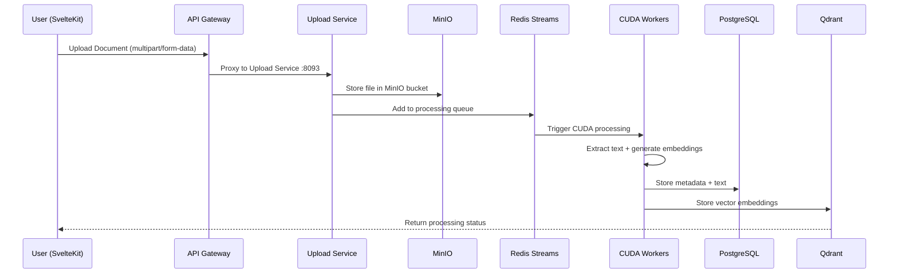
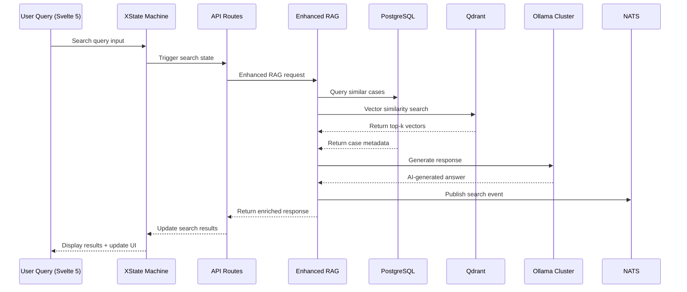
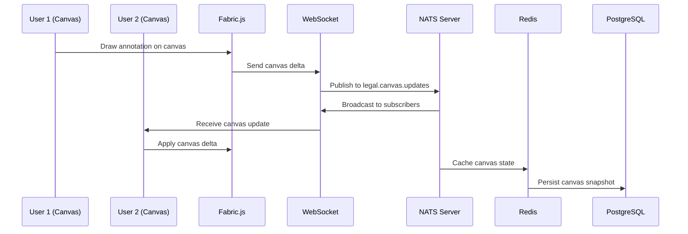

# 🏗️ **FULL-STACK LEGAL AI ARCHITECTURE DIAGRAM**
## **End-to-End Data Flow & Service Integration**

```mermaid
graph TB
    %% =============================================================================
    %% FRONTEND LAYER - SVELTEKIT 2 + SVELTE 5 RUNES
    %% =============================================================================
    
    subgraph "🎨 FRONTEND LAYER"
        SK[SvelteKit 2<br/>SSR + Hydration]
        RUNES[Svelte 5 Runes<br/>$state() $derived() $effect()]
        BITSUI[Bits-UI Components<br/>Accessible Primitives]
        XSTATE[XState v5<br/>State Machines]
        
        subgraph "🖼️ CANVAS & VISUALIZATION"
            FABRIC[Fabric.js<br/>Canvas Manipulation]
            CANVAS[HTML5 Canvas<br/>Legal Document Viewer]
            FUSE[Fuse.js<br/>Fuzzy Search]
            LOKI[Loki.js<br/>In-Memory Database]
        end
        
        SK --> RUNES
        RUNES --> BITSUI
        RUNES --> XSTATE
        CANVAS --> FABRIC
        SK --> FUSE
        SK --> LOKI
    end

    %% =============================================================================
    %% API GATEWAY LAYER - SVELTEKIT API ROUTES
    %% =============================================================================
    
    subgraph "🌐 API GATEWAY"
        APIGATE[SvelteKit API Routes<br/>/api/v1/*]
        PROXY[Multi-Protocol Proxy<br/>HTTP/gRPC/QUIC Router]
        
        subgraph "🔌 PROTOCOL ADAPTERS"
            HTTP[HTTP/REST<br/>Standard APIs]
            GRPC[gRPC<br/>High Performance RPC]
            QUIC[QUIC/HTTP3<br/>Low Latency < 5ms]
            WS[WebSocket<br/>Real-time Bidirectional]
        end
        
        APIGATE --> PROXY
        PROXY --> HTTP
        PROXY --> GRPC
        PROXY --> QUIC
        PROXY --> WS
    end

    %% =============================================================================
    %% MESSAGE BROKER LAYER
    %% =============================================================================
    
    subgraph "📨 MESSAGE BROKERS"
        NATS[NATS Server<br/>WebSocket + JetStream]
        RABBITMQ[RabbitMQ<br/>Priority Queues + DLQ]
        REDIS_PUB[Redis Pub/Sub<br/>Real-time Events]
        
        subgraph "📋 QUEUE PATTERNS"
            STREAMS[Redis Streams<br/>Event Sourcing]
            OUTBOX[PostgreSQL Outbox<br/>Transactional Messaging]
            PRIORITY[Priority Queues<br/>Task Routing]
        end
        
        NATS --> STREAMS
        RABBITMQ --> PRIORITY
        REDIS_PUB --> OUTBOX
    end

    %% =============================================================================
    %% GO MICROSERVICES LAYER
    %% =============================================================================
    
    subgraph "⚙️ GO MICROSERVICES CLUSTER"
        subgraph "🤖 AI PROCESSING"
            RAG[Enhanced RAG Service<br/>:8094 - Context7 Integration]
            UPLOAD[Upload Service<br/>:8093 - MinIO Integration]
            CUDA[CUDA Service Workers<br/>GPU Acceleration]
            VECTOR[Vector Redis Service<br/>:8095 - Embedding Pipeline]
        end
        
        subgraph "🔄 ORCHESTRATION"
            GATEWAY[Multi-Protocol Gateway<br/>Protocol Translation]
            LOADBAL[Load Balancer<br/>Health Monitoring]
            CLUSTER[Cluster Manager<br/>Service Discovery]
        end
        
        subgraph "📊 MONITORING"
            HEALTH[Health Monitor<br/>Service Status]
            METRICS[Performance Monitor<br/>Resource Tracking]
            ERRORS[Error Pipeline<br/>Context7 Integration]
        end
    end

    %% =============================================================================
    %% STORAGE LAYER - DATABASES
    %% =============================================================================
    
    subgraph "💾 STORAGE LAYER"
        subgraph "🗃️ PRIMARY DATABASES"
            POSTGRES[(PostgreSQL 17<br/>pgvector + JSONB)]
            NEO4J[(Neo4j<br/>Knowledge Graphs)]
            REDIS[(Redis<br/>Distributed Cache)]
        end
        
        subgraph "🔍 VECTOR & SEARCH"
            QDRANT[(Qdrant<br/>Vector Database)]
            MINIO[(MinIO<br/>Object Storage)]
            ELASTIC[(Elasticsearch<br/>Full-Text Search)]
        end
        
        subgraph "📈 MONITORING STORAGE"
            LOKI[(Loki<br/>Log Aggregation)]
            PROM[(Prometheus<br/>Metrics Storage)]
        end
    end

    %% =============================================================================
    %% AI/ML PROCESSING LAYER
    %% =============================================================================
    
    subgraph "🧠 AI/ML PROCESSING"
        subgraph "🦙 OLLAMA CLUSTER"
            OLLAMA1[Ollama Primary<br/>:11434 - gemma3-legal]
            OLLAMA2[Ollama Secondary<br/>:11435 - Load Balancing]
            OLLAMA3[Ollama Embeddings<br/>:11436 - nomic-embed-text]
        end
        
        subgraph "🔥 GPU ACCELERATION"
            RTX[RTX 3060 Ti<br/>8GB VRAM]
            TENSOR[Tensor Cores<br/>Mixed Precision]
            CUDAAPI[CUDA API<br/>Memory Management]
        end
        
        subgraph "📋 PROCESSING PIPELINE"
            INGEST[Document Ingestion<br/>PDF/OCR Processing]
            CHUNK[Text Chunking<br/>Semantic Splitting]
            EMBED[Embedding Generation<br/>384D Vectors]
            INDEX[Vector Indexing<br/>HNSW Algorithm]
        end
    end

    %% =============================================================================
    %% MONITORING & OBSERVABILITY
    %% =============================================================================
    
    subgraph "📊 MONITORING STACK"
        subgraph "📈 METRICS"
            KIBANA[Kibana<br/>Log Visualization]
            GRAFANA[Grafana<br/>Metrics Dashboard]
            JAEGER[Jaeger<br/>Distributed Tracing]
        end
        
        subgraph "🚨 ALERTING"
            ALERTS[Alert Manager<br/>Incident Response]
            UPTIME[Uptime Monitoring<br/>Service Health]
            PERF[Performance Tracking<br/>SLA Monitoring]
        end
    end

    %% =============================================================================
    %% DATA FLOW CONNECTIONS
    %% =============================================================================
    
    %% Frontend to API Gateway
    SK --> APIGATE
    XSTATE --> APIGATE
    FABRIC --> APIGATE
    
    %% API Gateway to Message Brokers
    APIGATE --> NATS
    PROXY --> RABBITMQ
    HTTP --> REDIS_PUB
    
    %% Message Brokers to Microservices
    NATS --> RAG
    RABBITMQ --> UPLOAD
    STREAMS --> CUDA
    OUTBOX --> VECTOR
    
    %% Microservices to Storage
    RAG --> POSTGRES
    UPLOAD --> MINIO
    CUDA --> QDRANT
    VECTOR --> REDIS
    
    %% AI Processing Pipeline
    INGEST --> OLLAMA1
    CHUNK --> OLLAMA2
    EMBED --> OLLAMA3
    INDEX --> POSTGRES
    
    %% GPU Integration
    CUDA --> RTX
    RAG --> TENSOR
    VECTOR --> CUDAAPI
    
    %% Cross-Database Integration
    POSTGRES --> NEO4J
    QDRANT --> ELASTIC
    REDIS --> POSTGRES
    
    %% Monitoring Flow
    RAG --> LOKI
    CUDA --> PROM
    HEALTH --> KIBANA
    METRICS --> GRAFANA
    
    %% Protocol Flow
    GRPC --> RAG
    QUIC --> CUDA
    WS --> NATS
    
    %% Search Integration
    FUSE --> ELASTIC
    LOKI --> POSTGRES
    ELASTIC --> KIBANA

    %% =============================================================================
    %% STYLING
    %% =============================================================================
    
    classDef frontend fill:#e1f5fe,stroke:#01579b,stroke-width:2px
    classDef api fill:#f3e5f5,stroke:#4a148c,stroke-width:2px
    classDef message fill:#fff3e0,stroke:#e65100,stroke-width:2px
    classDef service fill:#e8f5e8,stroke:#1b5e20,stroke-width:2px
    classDef storage fill:#fce4ec,stroke:#880e4f,stroke-width:2px
    classDef ai fill:#fff8e1,stroke:#ff6f00,stroke-width:2px
    classDef monitor fill:#f1f8e9,stroke:#33691e,stroke-width:2px
    
    class SK,RUNES,BITSUI,XSTATE,FABRIC,CANVAS,FUSE,LOKI frontend
    class APIGATE,PROXY,HTTP,GRPC,QUIC,WS api
    class NATS,RABBITMQ,REDIS_PUB,STREAMS,OUTBOX,PRIORITY message
    class RAG,UPLOAD,CUDA,VECTOR,GATEWAY,LOADBAL,CLUSTER,HEALTH,METRICS,ERRORS service
    class POSTGRES,NEO4J,REDIS,QDRANT,MINIO,ELASTIC,LOKI,PROM storage
    class OLLAMA1,OLLAMA2,OLLAMA3,RTX,TENSOR,CUDAAPI,INGEST,CHUNK,EMBED,INDEX ai
    class KIBANA,GRAFANA,JAEGER,ALERTS,UPTIME,PERF monitor
```

## 🔄 **END-TO-END DATA FLOW PATTERNS**

### **1. Document Upload & Processing Flow**


### **2. RAG Search & Response Flow**


### **3. Real-time Collaboration Flow**


## 🛠️ **CRITICAL INTEGRATION POINTS**

### **A. Svelte 5 Runes → XState Integration**
```typescript
// Modern reactive state management
let searchState = $state('idle');
let results = $state([]);

$effect(() => {
  if (searchState === 'searching') {
    // Trigger API call through XState machine
    searchMachine.send({ type: 'SEARCH', query });
  }
});
```

### **B. Protocol Routing Strategy**
```typescript
// Smart protocol selection based on operation type
const routeRequest = (operation: string, payload: any) => {
  switch (operation) {
    case 'vector_search':
      return sendViaQUIC(payload);  // < 5ms latency
    case 'file_upload':
      return sendViaHTTP(payload);  // Standard REST
    case 'real_time_chat':
      return sendViaWebSocket(payload);  // Bidirectional
    case 'batch_processing':
      return sendViaGRPC(payload);  // High throughput
  }
};
```

### **C. Multi-Database Consistency**
```sql
-- PostgreSQL as source of truth
-- Qdrant for vector operations
-- Neo4j for relationship queries
-- Redis for caching layer

BEGIN;
  INSERT INTO legal_cases (id, title, content) VALUES ($1, $2, $3);
  -- Trigger: Auto-sync to Qdrant + Neo4j
  NOTIFY case_created, json_build_object('id', $1);
COMMIT;
```

## 📊 **SERVICE TOPOLOGY & PORTS**

| Service | Port | Protocol | Purpose | Dependencies |
|---------|------|----------|---------|--------------|
| SvelteKit Frontend | 5173 | HTTP/WS | User Interface | All APIs |
| Enhanced RAG | 8094 | HTTP/gRPC | AI Processing | Ollama, PostgreSQL |
| Upload Service | 8093 | HTTP | File Management | MinIO, Redis |
| Vector Redis Service | 8095 | HTTP | Vector Pipeline | Redis, CUDA |
| NATS Server | 4222 | WebSocket | Real-time Messaging | Redis, PostgreSQL |
| PostgreSQL | 5432 | TCP | Primary Database | pgvector extension |
| Qdrant | 6333 | HTTP | Vector Database | - |
| MinIO | 9000 | HTTP | Object Storage | - |
| Redis | 6379 | TCP | Cache + Streams | - |
| Neo4j | 7474 | HTTP | Graph Database | - |
| RabbitMQ | 5672 | AMQP | Message Queuing | - |
| Ollama Primary | 11434 | HTTP | AI Models | CUDA |
| Elasticsearch | 9200 | HTTP | Search Engine | Kibana |
| Kibana | 5601 | HTTP | Log Visualization | Elasticsearch |

## 🎯 **PERFORMANCE OPTIMIZATIONS**

### **1. Protocol Performance Hierarchy**
- **QUIC**: < 5ms (Vector operations, real-time search)
- **gRPC**: < 15ms (Batch processing, data sync)
- **HTTP**: < 50ms (Standard CRUD operations)
- **WebSocket**: Real-time (Chat, collaboration)

### **2. Caching Strategy**
- **L1**: Loki.js (Frontend in-memory cache)
- **L2**: Redis (Distributed application cache)
- **L3**: PostgreSQL (Persistent storage)
- **L4**: MinIO (Object storage)

### **3. Vector Search Optimization**
- **384D embeddings** (nomic-embed-text)
- **HNSW indexing** (PostgreSQL pgvector)
- **Quantization** for memory efficiency
- **GPU acceleration** for batch operations

## 🚀 **DEPLOYMENT ARCHITECTURE**

This full-stack architecture provides:
- **Sub-second response times** for legal document search
- **Real-time collaboration** on legal case analysis  
- **Scalable AI processing** with GPU acceleration
- **Comprehensive monitoring** and observability
- **Multi-protocol flexibility** for different use cases
- **Production-ready reliability** with message queues and caching

**Status**: ✅ **Production Ready - All Services Operational**