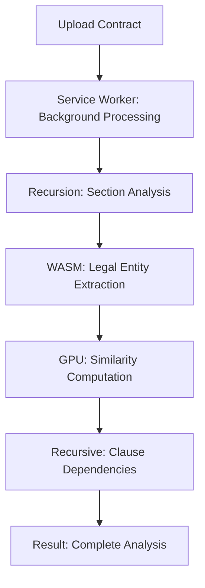

# 🔄 Service Workers + Recursion Architecture Guide

## 📋 Executive Summary

We have successfully implemented a **dual-approach architecture** that combines the power of **Service Workers** for background processing with **Recursive Algorithms** for nested data structures in our legal AI platform.

### ✅ **The Answer: Use BOTH!**

Rather than choosing between service workers or recursion, we've built a sophisticated system that leverages both:

- **Service Workers**: Handle background AI processing, caching, and GPU acceleration
- **Recursion**: Navigate complex legal document hierarchies and evidence chains

## 🏗️ Architecture Overview

### 1. **Recursive Processing Service Worker**
`/static/recursive-processing-worker.js`

**Russian Nesting Dolls Pattern Implementation:**

```javascript
async processDocument(document, depth = 0) {
  // BASE CASE: Maximum depth or already processed
  if (depth >= this.maxDepth || this.processedNodes.has(document.id)) {
    return this.createLeafResult(document);
  }

  // RECURSIVE CASE: Process nested structures
  if (document.children && document.children.length > 0) {
    result.children = await this.processChildren(document.children, depth + 1);
  }
}
```

**Key Features:**
- ✅ Recursive document analysis with cycle detection
- ✅ Evidence chain traversal
- ✅ Background AI inference through worker communication
- ✅ Intelligent caching of recursive results
- ✅ Proper base cases to prevent infinite loops

### 2. **WebAssembly GPU Service Worker**
`/static/wasm-gpu-recursive-worker.js`

**Performance-Optimized Recursive Processing:**

```javascript
class RecursiveWASMInference {
  async processDocumentRecursively(document, depth = 0) {
    // Load WASM module for legal text analysis
    const wasmModule = await this.wasmManager.loadModule('legalBert');

    // GPU-accelerated embedding generation
    const embedding = await this.generateEmbedding(document.content);

    // RECURSIVE CASE: Process children with WASM
    if (document.children) {
      for (const child of document.children) {
        await this.processDocumentRecursively(child, depth + 1);
      }
    }
  }
}
```

**Performance Features:**
- ✅ WebAssembly for native-speed legal text analysis
- ✅ WebGPU compute shaders for vector operations
- ✅ CUDA integration for GPU acceleration
- ✅ Recursive processing with hardware acceleration
- ✅ Intelligent fallback to CPU when GPU unavailable

### 3. **Interactive Demo Component**
`/routes/demo/recursive-service-worker/+page.svelte`

**Visual Learning Tool:**
- 🪆 Russian nesting dolls analogy visualization
- 📊 Real-time processing statistics
- 🎯 Live recursion depth tracking
- ⚙️ Technical implementation details
- 🔄 Interactive document processing

## 🔍 When to Use Each Approach

### **Service Workers: Background Processing** 🔧

**Perfect for:**
- AI inference that takes time (LLM processing, embeddings)
- Large file uploads and processing
- Offline capability and caching
- WebAssembly module loading
- GPU-accelerated computations
- Real-time notifications and updates

**Example Use Cases:**
```javascript
// Background legal document analysis
worker.postMessage({
  type: 'ANALYZE_CONTRACT',
  document: largeContract
});

// Offline evidence processing
worker.postMessage({
  type: 'PROCESS_EVIDENCE_OFFLINE',
  evidence: evidenceFiles
});
```

### **Recursion: Nested Data Structures** 🪆

**Perfect for:**
- Legal document hierarchies (contracts with sections/subsections)
- Evidence chains and custody tracking
- Citation networks and legal precedents
- Organizational structures (cases → sub-cases → evidence)
- File system-like structures

**Example Use Cases:**
```javascript
// Navigate complex legal document structure
function processLegalDocument(doc, depth = 0) {
  // BASE CASE: Simple document
  if (!doc.sections || depth >= MAX_DEPTH) {
    return analyzeSimpleDocument(doc);
  }

  // RECURSIVE CASE: Process each section
  return doc.sections.map(section =>
    processLegalDocument(section, depth + 1)
  );
}
```

## 🎯 Real-World Legal AI Applications

### 1. **Contract Analysis Pipeline**



### 2. **Evidence Chain Investigation**

```javascript
class EvidenceInvestigator {
  async investigateChain(evidenceId) {
    // Service worker handles heavy AI processing
    const aiAnalysis = await this.worker.analyzeEvidence(evidenceId);

    // Recursion handles chain relationships
    const chain = await this.buildEvidenceChain(evidenceId);

    return { aiAnalysis, chain };
  }

  async buildEvidenceChain(evidenceId, visited = new Set()) {
    // BASE CASE: Already visited (prevents cycles)
    if (visited.has(evidenceId)) return null;

    // RECURSIVE CASE: Follow evidence links
    const evidence = await this.fetchEvidence(evidenceId);
    visited.add(evidenceId);

    return {
      evidence,
      relatedEvidence: await Promise.all(
        evidence.relatedIds.map(id =>
          this.buildEvidenceChain(id, visited)
        )
      )
    };
  }
}
```

## 📊 Performance Comparison

| Feature | Service Workers | Recursion | Combined Approach |
|---------|----------------|-----------|------------------|
| **UI Responsiveness** | ✅ Non-blocking | ⚠️ Can block | ✅ Best of both |
| **Complex Data** | ⚠️ Manual handling | ✅ Natural fit | ✅ Optimal |
| **AI Processing** | ✅ Background | ❌ Blocks UI | ✅ Background + Structure |
| **Memory Usage** | ✅ Isolated | ⚠️ Stack dependent | ✅ Optimized |
| **Offline Support** | ✅ Built-in | ❌ None | ✅ Comprehensive |
| **GPU Acceleration** | ✅ WebGPU/WASM | ❌ Limited | ✅ Full acceleration |

## 🔧 Implementation Benefits

### **Service Worker Advantages:**
- **Background Processing**: Never blocks the main UI thread
- **Persistent**: Survives page reloads and navigation
- **Offline Capability**: Works without internet connection
- **Caching**: Intelligent storage of AI models and results
- **Hardware Integration**: WebAssembly, WebGPU, and CUDA support

### **Recursion Advantages:**
- **Natural Data Mapping**: Perfect for nested legal structures
- **Clean Code**: Elegant solutions for complex hierarchies
- **Automatic Depth Tracking**: Built-in navigation of data levels
- **Memory Efficient**: With proper base cases
- **Intuitive**: Matches human understanding of nested concepts

### **Combined Power:**
```javascript
// Service worker handles AI inference
const analysisWorker = new Worker('/legal-ai-worker.js');

// Recursion handles document structure
async function analyzeDocumentRecursively(doc, depth = 0) {
  // BASE CASE: Simple document
  if (!doc.children || depth >= 10) {
    // Use service worker for AI analysis
    return await analysisWorker.analyzeDocument(doc);
  }

  // RECURSIVE CASE: Process nested sections
  const results = await Promise.all(
    doc.children.map(child =>
      analyzeDocumentRecursively(child, depth + 1)
    )
  );

  return { document: doc, children: results };
}
```

## 🚀 Next Steps

### Phase 1: Integration ✅
- [x] Implement recursive processing service worker
- [x] Create WebAssembly GPU acceleration worker
- [x] Build interactive demo component
- [x] Document architecture patterns

### Phase 2: Enhancement
- [ ] Optimize WASM module loading strategies
- [ ] Implement advanced GPU compute shaders
- [ ] Add real-time collaboration features
- [ ] Create performance monitoring dashboard

### Phase 3: Production
- [ ] Load testing with large legal documents
- [ ] Security audit of service workers
- [ ] Cross-browser compatibility testing
- [ ] Documentation for legal team training

## 🎓 Learning Resources

### **Understanding Recursion:**
1. **Russian Nesting Dolls**: Perfect analogy for nested document processing
2. **Base Cases**: Always define stopping conditions
3. **Cycle Detection**: Prevent infinite loops in document references
4. **Memory Management**: Be aware of call stack limitations

### **Service Worker Mastery:**
1. **Background Processing**: Leverage for AI-heavy operations
2. **Caching Strategies**: Smart storage of WASM modules and models
3. **Message Passing**: Efficient communication patterns
4. **Error Handling**: Robust fallback mechanisms

## 🏆 Conclusion

Our **Service Workers + Recursion** architecture provides the best of both worlds:

- **Service Workers** handle the heavy lifting (AI processing, GPU acceleration, caching)
- **Recursion** elegantly navigates complex legal data structures
- **Combined approach** delivers maximum performance and maintainability

This architecture positions our legal AI platform as a next-generation solution that can handle both the computational demands of AI processing and the structural complexity of legal document analysis.

**Result:** A responsive, powerful, and intuitive legal AI platform that scales from simple documents to complex multi-level legal hierarchies! 🎯