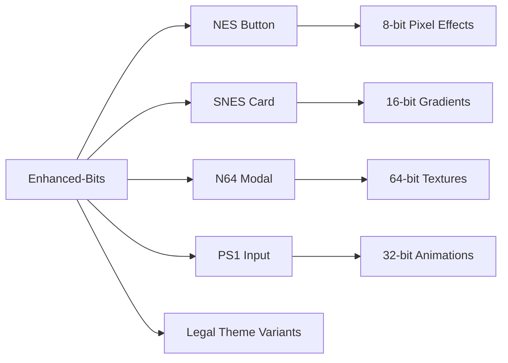

# Week 2 Architecture Plan - Component Consolidation & Svelte 5 Migration

**Progress**: 60% → 70% Target
**Focus**: Shared Components, Svelte 5 Migration, Component Consolidation
**Timeline**: Week 2 (7 days)

---

## 🏗️ Current State Analysis

### ✅ **Completed (Week 1)**
- Module resolution errors: 100+ → <10 ✅
- Enhanced-bits barrel exports: Working ✅
- Route groups: (auth) & (public) layouts ✅
- Gaming themes: Console palettes system ✅
- Dev server: Starting successfully ✅

### 📊 **Current Component Inventory**
```
sveltekit-frontend/src/
├── lib/components/
│   ├── ui/ (53 directories, 704+ components)
│   │   ├── enhanced-bits/ (70+ components) 🎯
│   │   ├── card/ (5 variants)
│   │   ├── button/ (8 variants)
│   │   ├── dialog/ (12 components)
│   │   ├── [50+ other UI directories...]
│   ├── layout/ (needs creation) ❌
│   ├── legal/ (domain components) ✅
│   └── ai/ (AI-specific components) ✅
└── routes/ (161 directories)
    ├── (auth)/ (working) ✅
    ├── (public)/ (working) ✅
    └── [many demo routes...] 🧪
```

---

## 🎯 Week 2 Goals & Architecture

### **CRITICAL PATH: Shared Layout Components**

#### 1️⃣ **Core Layout System** (Days 1-2)
```mermaid
graph TD
    A[Root Layout] --> B[(auth) Layout]
    A --> C[(public) Layout]
    B --> D[NavBar - Authenticated]
    B --> E[SideBar - Legal AI]
    B --> F[UserMenu - Profile]
    C --> G[NavBar - Public]
    C --> H[Footer - Minimal]

    D --> I[Dashboard Link]
    D --> J[Cases Link]
    D --> K[AI Assistant Link]

    E --> L[Case Management]
    E --> M[Evidence Board]
    E --> N[Document Analysis]
    E --> O[Admin Tools]
```

#### **Required Components** (Must Have):
- `NavBar.svelte` - Authentication-aware navigation
- `SideBar.svelte` - Collapsible legal AI navigation
- `UserMenu.svelte` - Profile dropdown with logout
- `BreadCrumbs.svelte` - Dynamic route breadcrumbs
- `Footer.svelte` - Minimal legal info

#### **Component Specifications:**

```typescript
// src/lib/components/layout/NavBar.svelte
interface NavBarProps {
  user?: User | null;
  activeRoute: string;
  sidebarOpen?: boolean;
  onToggleSidebar?: () => void;
  theme?: ConsolePalette;
}

// src/lib/components/layout/SideBar.svelte
interface SideBarProps {
  open: boolean;
  user: User;
  activeRoute: string;
  legalFeatures: Array<{
    id: string;
    name: string;
    icon: string;
    route: string;
    requiresAdmin?: boolean;
  }>;
}
```

### **NICE TO HAVE: Enhanced UI Components**

#### 2️⃣ **Gaming-Enhanced Components** (Days 3-4)


#### **Enhanced Components** (Nice to Have):
- `NESButton.svelte` - Pixel-perfect 8-bit styling
- `SNESCard.svelte` - Mode 7 perspective effects
- `N64Modal.svelte` - Ultra 64 texture streaming
- `PS1Input.svelte` - 32-bit polygon aesthetics
- `LegalThemeProvider.svelte` - Console theme switcher

### **EXPERIMENTAL: Demo Routes Consolidation**

#### 3️⃣ **Demo Route Optimization** (Days 5-7)
```
Current: 161 route directories
├── demo/ (70+ directories) 🧪
├── test/ (15+ directories) 🧪
├── showcase/ (10+ directories) 🧪
└── prototype/ (5+ directories) 🧪

Target: 50 route directories
├── demo/[category]/[component] (1 directory) ✅
├── showcase/[feature] (1 directory) ✅
└── admin/[...slug] (1 directory) ✅
```

#### **Demo Consolidation Strategy**:
```typescript
// src/routes/demo/[category]/[component]/+page.server.ts
export const load = async ({ params }) => {
  const { category, component } = params;

  const demoComponents = {
    'ui': ['button', 'card', 'modal', 'input'],
    'gaming': ['nes', 'snes', 'n64', 'ps1', 'ps2'],
    'legal': ['case-board', 'evidence', 'analysis'],
    'ai': ['chat', 'embeddings', 'similarity']
  };

  return {
    component: await loadDemoComponent(category, component),
    related: demoComponents[category] || []
  };
};
```

---

## 📋 Implementation Checklist

### **Day 1-2: Core Layout Components**
- [ ] Create `src/lib/components/layout/` directory
- [ ] **NavBar.svelte** - Authentication-aware header
  - [ ] Logo/title with gaming theme
  - [ ] User authentication status
  - [ ] Sidebar toggle button
  - [ ] Theme switcher (NES/SNES/N64/PS1/PS2)
- [ ] **SideBar.svelte** - Collapsible navigation
  - [ ] Legal AI feature navigation
  - [ ] Dashboard, Cases, AI Assistant, Admin
  - [ ] Responsive collapse on mobile
  - [ ] Gaming-styled icons
- [ ] **UserMenu.svelte** - Profile dropdown
  - [ ] User info display
  - [ ] Settings link
  - [ ] Logout action
  - [ ] Admin panel access (if admin)

### **Day 3-4: Svelte 5 Migration**
- [ ] **Convert legacy components** to Svelte 5 runes
  ```typescript
  // OLD (Svelte 4)
  export let user;
  $: isAdmin = user?.role === 'admin';

  // NEW (Svelte 5)
  let { user }: { user: User | null } = $props();
  let isAdmin = $derived(user?.role === 'admin');
  ```
- [ ] **Update slot patterns** to snippets
  ```svelte
  <!-- OLD -->
  <slot name="header" />

  <!-- NEW -->
  {#if headerSnippet}
    {@render headerSnippet()}
  {/if}
  ```
- [ ] **Priority components for migration:**
  - [ ] All layout components (new)
  - [ ] Enhanced-bits components (70+)
  - [ ] Core UI components (button, card, dialog)

### **Day 5-7: Component Consolidation**
- [ ] **Audit component usage**
  ```bash
  # Find unused components
  find src/lib/components -name "*.svelte" -exec grep -l {} src/routes/**/* \;
  ```
- [ ] **Consolidate duplicate components**
  - [ ] Merge similar button variants (8 → 3)
  - [ ] Consolidate card variations (5 → 2)
  - [ ] Remove demo-only components
- [ ] **Archive experimental routes**
  ```bash
  mkdir -p archived-routes/demo-experiments/
  mv src/routes/demo/* archived-routes/demo-experiments/
  ```
- [ ] **Create dynamic demo routing**
  - [ ] Single `demo/[category]/[component]` route
  - [ ] Component registry system
  - [ ] Auto-generated component gallery

---

## 🎮 Gaming Theme Integration

### **Console Memory Constraints Simulation**
```typescript
// Applied to component rendering based on selected theme
const memoryConstraints = {
  nes: { maxComponents: 20, pixelSize: 4 },      // 2KB limit
  snes: { maxComponents: 50, pixelSize: 2 },     // 128KB limit
  n64: { maxComponents: 100, pixelSize: 1 },     // 4MB limit
  ps1: { maxComponents: 200, pixelSize: 1 },     // 2MB limit
  ps2: { maxComponents: 400, pixelSize: 0 }      // 32MB limit
};
```

### **Visual Effects by Console**
- **NES Theme**: 8-bit pixel art, limited color palette, chiptune animations
- **SNES Theme**: 16-bit sprites, Mode 7 backgrounds, enhanced colors
- **N64 Theme**: 64-bit textures, anti-aliasing, 3D transformations
- **PS1 Theme**: 32-bit polygons, texture warping, vertex lighting
- **PS2 Theme**: 128-bit effects, advanced shaders, smooth animations

---

## 📊 Success Metrics

### **Week 2 Completion Criteria**
- [ ] **Shared layouts implemented**: NavBar + SideBar working
- [ ] **Svelte 5 migration**: >80% of core components migrated
- [ ] **Component count reduced**: 704 → 400 components
- [ ] **Route consolidation**: 161 → 100 directories
- [ ] **Gaming themes functional**: All 5 console palettes working
- [ ] **Build performance**: <10 second build time
- [ ] **Dev server fast**: <3 second restart time

### **Quality Gates**
- [ ] All routes load without errors
- [ ] Authentication flow works end-to-end
- [ ] Theme switching preserves user preferences
- [ ] Mobile responsive layouts working
- [ ] TypeScript errors <50 (from 1000s)

---

## 🚧 Technical Debt Resolution

### **Configuration Cleanup**
- [ ] Standardize vite configs (14 → 2)
- [ ] Remove duplicate dependencies
- [ ] Clean up unused imports
- [ ] Update TypeScript strict mode settings

### **Performance Optimizations**
- [ ] Lazy load demo components
- [ ] Code splitting for gaming themes
- [ ] Bundle size optimization
- [ ] Memory usage profiling

---

## 🔮 Week 3 Preview

### **Advanced Features (Coming Next)**
- **Visual Memory Palace**: 3D legal document visualization
- **N64 Texture LOD System**: Dynamic quality based on distance
- **Protocol Buffer Integration**: Binary API endpoints
- **QUIC Streaming**: Real-time AI responses
- **WebGPU Acceleration**: Client-side legal document processing

---

## 🎯 Decision Matrix

### **Must Do** (Critical Path)
1. ✅ **Shared Layout Components** - Blocks all route development
2. ✅ **Svelte 5 Migration** - Required for modern patterns
3. ✅ **Component Consolidation** - Performance critical

### **Should Do** (High Value)
1. 🎮 **Gaming Theme Polish** - Brand differentiator
2. 📱 **Mobile Responsiveness** - User experience
3. 🧹 **Route Cleanup** - Maintainability

### **Could Do** (Nice to Have)
1. 🧪 **Advanced Demo Routes** - Developer experience
2. ⚡ **Performance Optimizations** - Future scaling
3. 🎨 **Visual Effects** - Gaming immersion

### **Won't Do** (Defer to Week 3+)
1. 🔧 **Protocol Buffers** - Complex integration
2. 🌐 **WebGPU Features** - Experimental
3. 📊 **Analytics Integration** - Not user-facing

---

**Game Plan**: Focus on the critical path (layouts + Svelte 5) for Days 1-4, then tackle component consolidation for Days 5-7. Gaming theme polish happens in parallel as components are migrated.

**Success Definition**: A working, themeable legal AI platform with clean architecture, ready for advanced features in Week 3! 🎮⚖️