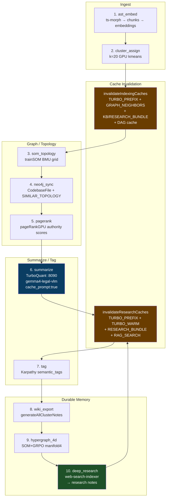

# Codebase Indexing Pipeline — How-To

End-to-end guide for the 10-stage codebase indexing pipeline with TurboQuant inference,
Karpathy wiki feedback loop, and event-driven cache invalidation.

**Last updated:** 2026-04-23 (post cache-invalidation cascade + GRPO reranker wiring)

---

## Architecture



---

## Stage Reference

| # | Stage | Implementation | Output |
|---|---|---|---|
| 1 | `ast_embed` | ts-morph batched `addSourceFilesAtPaths` + embeddinggemma | `codebase_chunk_index` + Qdrant `codebase_chunks_768` |
| 2 | `cluster_assign` | `kmeansWithCentroids` on 768-dim embeddings | `gpu_cluster` column on every chunk |
| 3 | `som_topology` | `trainSOM` builds 2D BMU grid + `SIMILAR_TOPOLOGY` adjacency | SOM grid coords written to Qdrant payload |
| 4 | `neo4j_sync` | Merge `CodebaseFile` nodes + edges | Neo4j graph ready for recommendations |
| 5 | `pagerank` | `pageRankGPU` (CUDA) or JS fallback | `page_rank_score` authority column |
| 6 | `summarize` | TurboQuant → `summarize-clusters-pg.ts` | `cluster_summaries` + Redis `summary:cluster:*` |
| 7 | `tag` | `/api/codebase-index/karpathy-tag` | `semantic_tags[]` on every chunk |
| 8 | `wiki_export` | `generateAllClusterNotes` → CouchDB + Redis | Durable cluster notes (Karpathy wiki) |
| 9 | `hypergraph_4d` | `buildHypergraph4D` writes `manifold4` column | `[som_x, som_y, semantic_z, grpo_w]` |
| 10 | `deep_research` | `runDeepResearchIndex` + `web-search-indexer` | Web results → Qdrant `knowledge_base` + research notes |

**Invalidation fires** at Stage 2 (indexing_complete — clears all downstream),
Stage 6 (research_update — refreshes summaries), and Stage 10 (research_update — refreshes research bundles).

---

## Running the Pipeline

### Full pipeline (SSE-streamed)

```bash
# From sveltekit-frontend/
curl -N -X POST http://localhost:5173/api/codebase-index/orchestrate \
  -H "Content-Type: application/json" \
  -d '{
    "stages": ["ast_embed","cluster_assign","som_topology","neo4j_sync","pagerank","summarize","tag","wiki_export","hypergraph_4d","deep_research"],
    "summarize": true,
    "deepResearch": true,
    "exportWiki": true
  }'
```

SSE events stream back as `{ stage, status, message, progress }` so the admin page
can render a live progress bar.

### Single-stage (e.g., refresh summaries only)

```bash
curl -N -X POST http://localhost:5173/api/codebase-index/orchestrate \
  -H "Content-Type: application/json" \
  -d '{ "stages": ["summarize"], "summarize": true }'
```

### TurboQuant-first cluster summarization (standalone script)

```bash
# Requires TurboQuant llama-server on :8090 (see "TurboQuant setup" below)
cd sveltekit-frontend
npx tsx scripts/summarize-clusters-pg.ts --force --cluster=0

# Falls back to Ollama :11434 automatically if TurboQuant unhealthy
```

---

## TurboQuant Setup (Inference Layer)

TurboQuant's `cache_prompt: true` computes the system-prompt KV state **once** and
reuses it across all 20 cluster summaries, saving ~18s per run on an 8GB GPU.

| Port | Service | Model | VRAM |
|---|---|---|---|
| `8090` | llama-server.exe (TurboQuant) | `gemma4-legal-vlm.gguf` + `mmproj-BF16.gguf` | 5.8 GB |
| `11434` | Ollama (fallback) | `gemma4-legal-vlm:latest` | swappable |

Start TurboQuant via VS Code task: **⚡ TurboQuant: Start (vision + text, :8090)**

Health check: `curl http://127.0.0.1:8090/health` → `{"status":"ok"}`

---

## Cache Invalidation Cascade

Before this session the pipeline relied on TTL expiry only (10–30 min stale data).
Now it's event-driven:

| Trigger | Function | Patterns Cleared |
|---|---|---|
| `cluster_assign` completes | `invalidateIndexingCaches()` | `turbo:prefix:*`, `turbo:warm:*`, `turbo:dym:*`, `graph:case:*:neighbors`, `kb_bundle:*`, `research_bundle:*`, `summary:cluster:*`, `rag:search*`, `llm:semantic:*` + CouchDB `dag_cache` purge |
| `summarize` completes | `invalidateResearchCaches()` | `turbo:prefix:*`, `turbo:warm:*`, `research_bundle:*`, `kb_bundle:*`, `rag:search*` |
| `deep_research` completes | `invalidateResearchCaches()` | (same as above — refreshes TurboQuant prefix anchors that embed research summaries) |

**Why:** TurboQuant pre-loads "prefix anchors" into GPU KV slots — system prompts
that include the latest cluster summaries, RL policy weights, and DYM suggestions.
When the underlying RAG data changes, those anchors go stale. Invalidation forces
them to rebuild on next inference.

---

## Karpathy Wiki Feedback Loop

Deep research findings and error-prone domains are captured as durable notes:

| Node Type | Function | Triggered By |
|---|---|---|
| **Cluster note** | `generateClusterNote` | Stage 8 (wiki_export) |
| **Research note** | `recordResearchNote` | Stage 10 (deep_research) |
| **Playbook note** | `buildPlaybookNote` | Stage 6 (summarize) — fires for `ace`, `rag`, `indexer` domains |
| **Retrieval note** | `recordRetrievalNote` | Per-query in RAG orchestrator |

All notes live in CouchDB + Redis (`kb_bundle:*`), feeding back into ACE context
assembly and GRPO reranking on the next query.

---

## Admin Visualization

**URL:** [http://localhost:5173/admin/codebase-index](http://localhost:5173/admin/codebase-index)

Sibling pages:
- `/admin/cache` — Redis / memory / GPU buffer pool stats
- `/admin/codebase-graph` — Neo4j graph explorer (SIMILAR_TOPOLOGY edges)
- `/admin/search-intelligence` — GRPO reranker leaderboard, RL audit trail
- `/admin/topology` — SOM grid + cluster heatmap
- `/admin/knowledge-search` — wiki note browser

The orchestrate endpoint streams SSE events so any of these pages can subscribe
to live progress via `EventSource`.

---

## VS Code Tasks (Pipeline Control)

All tasks live in `.vscode/tasks.json`. Run via `Ctrl+Shift+P` → **Tasks: Run Task**:

| Task Label | Action |
|---|---|
| `📚 Admin: Open Codebase Pipeline` | Opens `/admin/codebase-index` in VS Code Simple Browser |
| `🔄 Pipeline: Run Full Orchestrate (SSE)` | Triggers all 10 stages, streams progress to terminal |
| `🔄 Pipeline: Summarize Only` | Stage 6 only — regenerates cluster summaries via TurboQuant |
| `🔄 Pipeline: Deep Research Only` | Stage 10 only — refreshes research notes |
| `🔄 Pipeline: Invalidate Downstream Caches` | Fires `invalidateIndexingCaches` manually |
| `⚡ TurboQuant: Start (vision + text, :8090)` | Starts llama-server with VLM |
| `⚡ TurboQuant: Health Check` | Verifies `:8090/health` |

---

## Troubleshooting

**TurboQuant falls back to Ollama** — check `curl http://127.0.0.1:8090/health`.
If llama-server crashed, restart via the TurboQuant task.

**Stale summaries after re-indexing** — Verify invalidation fired:
```bash
redis-cli --scan --pattern "turbo:prefix:*" | head
# should be empty or only have fresh keys (TTL < original)
```

**Deep research runs but no wiki notes** — Check CouchDB `wiki_notes` DB.
`recordResearchNote` is fire-and-forget; errors are swallowed to avoid
blocking the pipeline. Check server logs for `[karpathy-wiki]` entries.

**svelte-check errors after changes** — Expected invariants:
- `AceChunkContext` has both `gpuCluster` and `somCluster` fields
- `CACHE_PATTERNS` includes `TURBO_PREFIX`, `TURBO_WARM`, `TURBO_DYM`
- `InvalidationType` includes `'indexing_complete'`, `'cluster_reassign'`, `'research_update'`

---

## Related Files

| Path | Role |
|---|---|
| `src/routes/api/codebase-index/orchestrate/+server.ts` | Pipeline orchestrator (SSE) |
| `src/lib/server/cache/invalidation.ts` | Cache cascade functions |
| `src/lib/server/cache/dag-cache.ts` | CouchDB DAG ordering cache + purge |
| `src/lib/server/indexer/karpathy-wiki.ts` | Wiki note authors (cluster/research/playbook/retrieval) |
| `src/lib/server/indexer/web-search-indexer.ts` | Deep research (Stage 10) |
| `src/lib/server/retrieval/orchestrator.ts` | Main RAG orchestrator (w/ LangExtract GRPO reranker) |
| `src/lib/server/retrieval/langextract-reranker.ts` | 3-pass entity + section + retrieval fusion |
| `scripts/summarize-clusters-pg.ts` | Standalone summarizer w/ TurboQuant-first inference |
