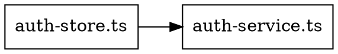

# AST-Based Error Analyzer - Quick Start Guide

## 🎯 What It Does

The AST analyzer uses **ts-morph** to perform deep TypeScript code analysis beyond simple error detection:

### Capabilities:
1. **Import/Export Graph** - Map all module dependencies
2. **Circular Dependency Detection** - Find dependency cycles
3. **Unused Export Detection** - Identify dead code
4. **Type Relationship Analysis** - Track interfaces/types/aliases
5. **Symbol Resolution** - Find all identifier usage
6. **Scope Analysis** - Understand variable scopes

---

## 🚀 Usage Examples

### 1. Analyze Current File
```bash
# In VS Code: Run task "🔍 AST: Analyze Single File"
# Or manually:
node scripts/ast-error-analyzer.mjs --file src/lib/auth/auth-store.ts
```

**Output:**
```
📄 Analyzing: src/lib/auth/auth-store.ts
   - Found 5 imports
   - Found 2 exports
   - Found 47 unique symbols
   - Found 1 type alias
   - Found 0 errors
```

### 2. Analyze Entire Directory
```bash
node scripts/ast-error-analyzer.mjs --dir src/lib/services
```

**Output:**
```
📂 Found 23 TypeScript files in src/lib/services
📄 Analyzing: src/lib/services/ai-service.ts
📄 Analyzing: src/lib/services/rabbitmq-service.ts
...
🔄 Detecting circular dependencies...
⚠️  Found 2 circular dependencies:
   1. services/ai-service.ts → services/gpu-cache.ts → services/ai-service.ts
   2. services/auth.ts → services/user.ts → services/auth.ts

🔍 Finding unused exports...
📊 Found 12 potentially unused exports
   - initializeCache in services/cache-utils.ts:45
   - validateToken in services/auth-helpers.ts:78
   ... and 10 more
```

### 3. Full Project Analysis
```bash
node scripts/ast-error-analyzer.mjs --graph full-project-ast.json
```

**Output:** JSON file with complete analysis:
```json
{
  "timestamp": "2025-12-18T23:30:00.000Z",
  "files": {
    "src/lib/auth/auth-store.ts": {
      "imports": [...],
      "exports": [...],
      "symbols": [...],
      "types": [...],
      "errors": [...]
    }
  },
  "importGraph": {
    "src/lib/auth/auth-store.ts": [
      "$lib/services/auth-service",
      "svelte/store"
    ]
  },
  "circularDependencies": [...],
  "unusedExports": [...],
  "stats": {
    "totalFiles": 458,
    "totalImports": 2341,
    "totalExports": 1876,
    "totalSymbols": 12453,
    "circularDeps": 7
  }
}
```

---

## 📊 Output Structure

### Per-File Analysis:
```json
{
  "path": "src/lib/services/ai-service.ts",
  "imports": [
    {
      "module": "@anthropic-ai/sdk",
      "named": ["Anthropic"],
      "default": null,
      "line": 3
    }
  ],
  "exports": [
    {
      "type": "function",
      "name": "generateResponse",
      "line": 45
    }
  ],
  "symbols": ["Anthropic", "generateResponse", "config", ...],
  "types": [
    {
      "type": "interface",
      "name": "AIServiceConfig",
      "line": 12
    }
  ],
  "errors": [
    {
      "line": 78,
      "code": "TS2304",
      "message": "Cannot find name 'UnknownType'.",
      "category": 1
    }
  ]
}
```

---

## 🔍 Use Cases

### 1. Find Circular Dependencies
**Problem:** Build fails with "circular dependency detected"
**Solution:**
```bash
node scripts/ast-error-analyzer.mjs --graph circular-check.json
# Check output for circularDependencies array
```

### 2. Identify Dead Code
**Problem:** Large bundle size, need to remove unused exports
**Solution:**
```bash
node scripts/ast-error-analyzer.mjs --dir src/lib/services
# Check output for "potentially unused exports"
```

### 3. Understand Import Graph
**Problem:** Need to refactor module structure
**Solution:**
```bash
node scripts/ast-error-analyzer.mjs --graph import-graph.json
# Generates 5 files for graph-to-tree analysis:
#   - import-graph.json       (Full analysis with knowledge base)
#   - import-graph.cypher     (Neo4j import script)
#   - import-graph.d3.json    (D3.js visualization format)
#   - import-graph.dot        (Graphviz diagram)
#   - import-graph.tree.json  (Tree adapter for RAG/KAG)
```

**Knowledge Base Structure:**
- **Nodes:** File entities with metadata (import/export counts, errors)
- **Edges:** Import relationships with directionality
- **Trees:** Hierarchical directory structure
- **Clusters:** Semantic groupings by domain/feature

**Adapter Integration:**
```javascript
// Tree adapter format for RAG/KAG systems
{
  "version": "1.0",
  "metadata": { "nodeCount": 458, "edgeCount": 2341 },
  "tree": { /* hierarchical structure */ },
  "clusters": [ /* semantic groupings */ ],
  "graph": { "nodes": [...], "edges": [...] }
}
```

### 4. Find Missing Imports
**Problem:** TypeScript errors about undefined names
**Solution:**
```bash
node scripts/ast-error-analyzer.mjs --file src/lib/problematic-file.ts
# Check "errors" array for "Cannot find name" entries
```

### 5. Type Relationship Mapping
**Problem:** Need to understand type dependencies
**Solution:**
```bash
node scripts/ast-error-analyzer.mjs --dir src/lib/types
# Check "types" array in each file
```

---

## 🛠️ VS Code Integration

### Tasks Available:
1. **🔍 AST: Analyze Single File**
   - Analyzes currently open file
   - Keyboard shortcut: `Ctrl+Shift+P` → "Run Task" → "AST: Analyze Single File"

2. **🔍 AST: Analyze Directory (src/lib/services)**
   - Scans entire services directory
   - Best for: Service architecture analysis

3. **🔍 AST: Full Project Analysis**
   - Complete codebase scan
   - Generates: `reports/latest/full-project-ast.json`
   - Best for: Dependency graphing, refactoring planning

---

## 📈 Performance

| Scope | Files | Time | Output Size |
|-------|-------|------|-------------|
| Single File | 1 | <1s | ~10 KB |
| Directory (services) | ~30 | ~5s | ~500 KB |
| Full Project | 458 | ~30s | ~5 MB |

---

## 📊 Knowledge Base Export Formats

The AST analyzer automatically generates **4 additional formats** for graph-to-tree analysis and adapter integration:

### 1. Neo4j Cypher (`.cypher`)
**Purpose:** Direct import into Neo4j graph database
**Format:**
```cypher
CREATE (n0:File {id: 0, path: "src/lib/auth/auth-store.ts", imports: 5, exports: 2});
CREATE (n1:File {id: 1, path: "src/lib/services/auth-service.ts", imports: 8, exports: 3});
MATCH (a:File {id: 0}), (b) WHERE b.path = "src/lib/services/auth-service" CREATE (a)-[:IMPORTS]->(b);
```

**Use Case:** Query dependency relationships with Cypher
```cypher
// Find all files that import auth-service
MATCH (f:File)-[:IMPORTS]->(s:File {path: "src/lib/services/auth-service.ts"})
RETURN f.path

// Find circular dependencies
MATCH path = (a:File)-[:IMPORTS*2..]->(a)
RETURN path
```

### 2. D3.js Format (`.d3.json`)
**Purpose:** Web-based interactive graph visualization
**Format:**
```json
{
  "nodes": [
    {"id": 0, "type": "file", "label": "auth-store.ts", "metadata": {...}},
    {"id": 1, "type": "file", "label": "auth-service.ts", "metadata": {...}}
  ],
  "links": [
    {"source": 0, "target": "src/lib/services/auth-service", "type": "imports"}
  ],
  "tree": {"name": "src", "children": [...]}
}
```

**Use Case:** Create force-directed graph in browser
```html
<script src="https://d3js.org/d3.v7.min.js"></script>
<script>
  d3.json('import-graph.d3.json').then(data => {
    // Render interactive graph visualization
  });
</script>
```

### 3. Graphviz DOT (`.dot`)
**Purpose:** Generate static dependency diagrams
**Format:**


**Use Case:** Generate PNG/SVG diagrams
```bash
# Install Graphviz: https://graphviz.org/download/
dot -Tpng import-graph.dot -o dependency-graph.png
dot -Tsvg import-graph.dot -o dependency-graph.svg
```

### 4. Tree Adapter (`.tree.json`)
**Purpose:** RAG/KAG integration for AI-powered analysis
**Format:**
```json
{
  "version": "1.0",
  "metadata": {
    "timestamp": "2025-12-18T23:30:00.000Z",
    "nodeCount": 458,
    "edgeCount": 2341
  },
  "tree": {
    "name": "src",
    "children": [
      {"name": "lib", "type": "directory", "children": [...]},
      {"name": "routes", "type": "directory", "children": [...]}
    ]
  },
  "clusters": [
    {
      "name": "src/lib/services",
      "files": ["auth-service.ts", "ai-service.ts", ...],
      "type": "semantic-cluster"
    }
  ],
  "graph": {
    "nodes": [...],
    "edges": [...]
  }
}
```

**Use Case:** Feed into LLM for intelligent refactoring
```javascript
// Load tree adapter format
const kb = JSON.parse(fs.readFileSync('import-graph.tree.json'));

// Extract semantic clusters for RAG context
const serviceClusters = kb.clusters.filter(c => c.name.includes('services'));

// Build prompt for LLM
const prompt = `Analyze these ${serviceClusters.length} service modules and suggest refactoring...`;
```

---

## 🔗 Adapter Integration Examples

### Example 1: Build Dependency Graph for RAG
```javascript
import fs from 'fs';

const kb = JSON.parse(fs.readFileSync('reports/latest/import-graph.tree.json'));

// Find all services with high import counts
const heavilyUsedServices = kb.graph.nodes
  .filter(n => n.metadata.importCount > 10)
  .map(n => n.path);

console.log('Most depended-on services:', heavilyUsedServices);
// Use for RAG context prioritization
```

### Example 2: Generate Refactoring Plan
```javascript
// Load tree structure
const kb = JSON.parse(fs.readFileSync('reports/latest/import-graph.tree.json'));

// Find tightly coupled clusters
const tightlyCoupled = kb.clusters
  .filter(c => c.files.length > 20)
  .map(c => ({ dir: c.name, fileCount: c.files.length }));

// Suggest splitting large clusters
tightlyCoupled.forEach(cluster => {
  console.log(`Consider splitting ${cluster.dir} (${cluster.fileCount} files)`);
});
```

### Example 3: Neo4j Query for Circular Deps
```cypher
// After importing .cypher file into Neo4j
MATCH path = (a:File)-[:IMPORTS*2..5]->(a)
WHERE length(path) > 1
RETURN [node in nodes(path) | node.path] as cycle
ORDER BY length(path)
LIMIT 10
```

---

## 🔧 Advanced Options

### Custom Output Path:
```bash
node scripts/ast-error-analyzer.mjs --graph custom-analysis.json
```

### Combine with Error Analysis:
```bash
# Generate errors first
node scripts/generate-errors-jsonl.mjs --tool tsc

# Then analyze AST
node scripts/ast-error-analyzer.mjs --dir src/lib/services

# Compare: TSC errors vs AST diagnostics
```

### Integration with Phase 72 Pipeline:
```bash
# 1. Generate errors
node scripts/generate-errors-jsonl.mjs --tool both

# 2. Generate embeddings
node scripts/embed-errors-batch-optimized.mjs --batch 2000

# 3. Run AST analysis
node scripts/ast-error-analyzer.mjs --graph phase72-ast-graph.json

# 4. Combine insights for smarter fixes
node scripts/smart-error-fixer-phase72.mjs --use-ast
```

---

## 🐛 Troubleshooting

### Issue: "ts-morph not found"
**Solution:**
```bash
npm install --save-dev ts-morph
```

### Issue: "Cannot find tsconfig.json"
**Solution:** Script automatically looks for `tsconfig.json` in project root. Ensure it exists.

### Issue: "Analysis takes too long"
**Solution:** Use `--dir` with specific subdirectory instead of full project scan.

### Issue: "Out of memory"
**Solution:**
```bash
NODE_OPTIONS="--max-old-space-size=8192" node scripts/ast-error-analyzer.mjs
```

---

## 📚 Reference

### AST Node Types Analyzed:
- `ImportDeclaration` - All import statements
- `ExportDeclaration` - All export statements
- `FunctionDeclaration` - Function definitions
- `ClassDeclaration` - Class definitions
- `VariableStatement` - Variable declarations
- `InterfaceDeclaration` - Interface definitions
- `TypeAliasDeclaration` - Type aliases
- `Identifier` - All identifiers (for symbol tracking)

### Error Categories (from ts-morph):
- `0` - Warning
- `1` - Error
- `2` - Suggestion
- `3` - Message

---

## 🎯 Next Steps

1. **Install ts-morph** (if not done):
   ```bash
   npm install --save-dev ts-morph
   ```

2. **Test on problematic file**:
   ```bash
   node scripts/ast-error-analyzer.mjs --file src/lib/services/ai-service.ts
   ```

3. **Generate full project graph**:
   ```bash
   node scripts/ast-error-analyzer.mjs --graph full-project-ast.json
   ```

4. **Review output**:
   - Check `reports/latest/full-project-ast.json`
   - Look for circular dependencies
   - Identify unused exports

5. **Integrate with Phase 72**:
   - Use AST insights to guide smart fixes
   - Combine with semantic error clustering
   - Prioritize fixes based on import graph

---

**Created:** 2025-12-18T23:30:00Z
**Part of:** Phase 72 KAG/RAG Error Fixing System
**Status:** ✅ Ready to use (ts-morph installing)
