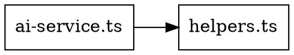

# Knowledge Base Export Formats - Quick Reference

**Generated by:** AST Error Analyzer (Phase 72)
**Purpose:** Graph-to-tree analysis and adapter integration
**Created:** 2025-12-18

---

## 🎯 Overview

Every AST analysis run generates **5 files** with different formats for various use cases:

| Format | File Extension | Use Case | Tool Integration |
|--------|---------------|----------|------------------|
| **Base JSON** | `.json` | Complete analysis data | Direct parsing |
| **Neo4j** | `.cypher` | Graph database | Neo4j import |
| **D3.js** | `.d3.json` | Web visualization | D3.js force graphs |
| **Graphviz** | `.dot` | Static diagrams | Graphviz rendering |
| **Tree Adapter** | `.tree.json` | RAG/KAG integration | LLM context feeding |

---

## 📊 Format Details

### 1. Base JSON (`.json`)
**Full analysis with all data structures**

```json
{
  "timestamp": "2025-12-18T23:30:00.000Z",
  "files": { /* per-file analysis */ },
  "importGraph": { /* dependency mapping */ },
  "circularDependencies": [ /* cycles detected */ ],
  "unusedExports": [ /* dead code */ ],
  "knowledgeBase": {
    "nodes": [ /* graph nodes */ ],
    "edges": [ /* relationships */ ],
    "trees": [ /* hierarchical structures */ ],
    "clusters": [ /* semantic groupings */ ]
  },
  "stats": { /* summary metrics */ }
}
```

**Use for:** Complete programmatic access

---

### 2. Neo4j Cypher (`.cypher`)
**Direct import into Neo4j graph database**

```cypher
CREATE (n0:File {id: 0, path: "src/lib/services/ai-service.ts", imports: 12, exports: 5});
CREATE (n1:File {id: 1, path: "src/lib/utils/helpers.ts", imports: 3, exports: 8});
MATCH (a:File {id: 0}), (b) WHERE b.path = "src/lib/utils/helpers" CREATE (a)-[:IMPORTS]->(b);
```

**Import to Neo4j:**
```bash
# Using neo4j-shell
cat reports/latest/project-knowledge-base.cypher | cypher-shell -u neo4j -p password

# Or via web interface
# Copy contents and paste into Neo4j Browser query editor
```

**Example Queries:**
```cypher
// Find most depended-on files
MATCH (f:File)<-[:IMPORTS]-(dependent)
RETURN f.path, count(dependent) as dependents
ORDER BY dependents DESC
LIMIT 10

// Find circular dependencies
MATCH path = (a:File)-[:IMPORTS*2..5]->(a)
RETURN [node in nodes(path) | node.path] as cycle

// Find files with no imports (potential entry points)
MATCH (f:File)
WHERE NOT (f)-[:IMPORTS]->()
RETURN f.path
```

---

### 3. D3.js Format (`.d3.json`)
**Web-based interactive visualization**

```json
{
  "nodes": [
    {"id": 0, "type": "file", "label": "ai-service.ts", "metadata": {...}},
    {"id": 1, "type": "file", "label": "helpers.ts", "metadata": {...}}
  ],
  "links": [
    {"source": 0, "target": "src/lib/utils/helpers", "type": "imports"}
  ],
  "tree": {"name": "src", "children": [...]}
}
```

**Visualization Example:**
```html
<!DOCTYPE html>
<html>
<head>
  <script src="https://d3js.org/d3.v7.min.js"></script>
</head>
<body>
  <svg width="960" height="600"></svg>
  <script>
    d3.json('reports/latest/project-knowledge-base.d3.json').then(data => {
      const svg = d3.select('svg');
      const simulation = d3.forceSimulation(data.nodes)
        .force('link', d3.forceLink(data.links).id(d => d.id))
        .force('charge', d3.forceManyBody().strength(-300))
        .force('center', d3.forceCenter(480, 300));

      // Render nodes and links
      const link = svg.append('g').selectAll('line')
        .data(data.links).enter().append('line')
        .attr('stroke', '#999');

      const node = svg.append('g').selectAll('circle')
        .data(data.nodes).enter().append('circle')
        .attr('r', 5)
        .attr('fill', '#69b3a2');

      simulation.on('tick', () => {
        link.attr('x1', d => d.source.x).attr('y1', d => d.source.y)
            .attr('x2', d => d.target.x).attr('y2', d => d.target.y);
        node.attr('cx', d => d.x).attr('cy', d => d.y);
      });
    });
  </script>
</body>
</html>
```

---

### 4. Graphviz DOT (`.dot`)
**Generate static dependency diagrams**



**Generate Images:**
```bash
# Install Graphviz first: https://graphviz.org/download/

# PNG
dot -Tpng reports/latest/project-knowledge-base.dot -o dependency-graph.png

# SVG (scalable)
dot -Tsvg reports/latest/project-knowledge-base.dot -o dependency-graph.svg

# PDF
dot -Tpdf reports/latest/project-knowledge-base.dot -o dependency-graph.pdf

# Interactive HTML
dot -Tsvg reports/latest/project-knowledge-base.dot | dot2html > interactive.html
```

**Advanced Layouts:**
```bash
# Hierarchical top-down
dot -Tpng -Grankdir=TB graph.dot -o top-down.png

# Circular layout
circo -Tpng graph.dot -o circular.png

# Radial layout
twopi -Tpng graph.dot -o radial.png
```

---

### 5. Tree Adapter (`.tree.json`)
**RAG/KAG integration for AI systems**

```json
{
  "version": "1.0",
  "metadata": {
    "timestamp": "2025-12-18T23:30:00.000Z",
    "nodeCount": 2242,
    "edgeCount": 5783
  },
  "tree": {
    "name": "src",
    "type": "directory",
    "children": [
      {
        "name": "lib",
        "type": "directory",
        "children": [
          {
            "name": "services",
            "type": "directory",
            "children": [
              {"name": "ai-service.ts", "path": "src/lib/services/ai-service.ts", "type": "file"}
            ]
          }
        ]
      }
    ]
  },
  "clusters": [
    {
      "name": "src/lib/services",
      "files": ["ai-service.ts", "auth-service.ts", "gpu-cache.ts"],
      "type": "semantic-cluster"
    }
  ],
  "graph": {
    "nodes": [...],
    "edges": [...]
  }
}
```

**RAG Integration Example:**
```javascript
import fs from 'fs';
import { Ollama } from 'ollama';

const kb = JSON.parse(fs.readFileSync('reports/latest/project-knowledge-base.tree.json'));
const ollama = new Ollama({ host: 'http://localhost:11434' });

// Extract high-priority files for refactoring
const errorProneFiles = kb.graph.nodes
  .filter(n => n.metadata.errorCount > 50)
  .sort((a, b) => b.metadata.errorCount - a.metadata.errorCount)
  .slice(0, 10);

// Build RAG context
const context = errorProneFiles.map(node => {
  const cluster = kb.clusters.find(c => c.files.some(f => f.includes(node.label)));
  return {
    file: node.path,
    errors: node.metadata.errorCount,
    cluster: cluster?.name || 'uncategorized',
    imports: node.metadata.importCount,
    exports: node.metadata.exportCount
  };
});

// Generate refactoring plan with LLM
const prompt = `Analyze these error-prone files and suggest refactoring:
${JSON.stringify(context, null, 2)}

Consider:
1. High import counts may indicate tight coupling
2. Files in same cluster should be refactored together
3. High error counts suggest architectural issues`;

const response = await ollama.chat({
  model: 'gemma3-legal',
  messages: [{ role: 'user', content: prompt }]
});

console.log('Refactoring Plan:', response.message.content);
```

---

## 🔗 Integration Patterns

### Pattern 1: Knowledge Graph for Semantic Search
```javascript
// Load tree adapter format
const kb = JSON.parse(fs.readFileSync('project-knowledge-base.tree.json'));

// Find files by semantic cluster
function findFilesInCluster(clusterName) {
  const cluster = kb.clusters.find(c => c.name.includes(clusterName));
  return cluster ? cluster.files : [];
}

const serviceFiles = findFilesInCluster('services');
const componentFiles = findFilesInCluster('components');

// Use for RAG context prioritization
const context = [...serviceFiles, ...componentFiles].map(file => {
  const node = kb.graph.nodes.find(n => n.path.includes(file));
  return { file, importance: node.metadata.importCount };
});
```

### Pattern 2: Circular Dependency Resolver
```javascript
const kb = JSON.parse(fs.readFileSync('project-knowledge-base.tree.json'));

// Find strongly connected components (cycles)
function findCycles() {
  const cycles = [];
  const visited = new Set();

  function dfs(nodeId, path) {
    if (path.includes(nodeId)) {
      cycles.push(path.slice(path.indexOf(nodeId)));
      return;
    }
    if (visited.has(nodeId)) return;

    visited.add(nodeId);
    const edges = kb.graph.edges.filter(e => e.source === nodeId);
    edges.forEach(edge => dfs(edge.target, [...path, nodeId]));
  }

  kb.graph.nodes.forEach(node => dfs(node.id, []));
  return cycles;
}

const cycles = findCycles();
console.log('Circular dependencies found:', cycles.length);
```

### Pattern 3: Dependency Impact Analysis
```javascript
const kb = JSON.parse(fs.readFileSync('project-knowledge-base.tree.json'));

// Calculate impact score (transitive dependencies)
function calculateImpactScore(filePath) {
  const node = kb.graph.nodes.find(n => n.path === filePath);
  if (!node) return 0;

  const dependents = kb.graph.edges.filter(e => e.target === node.path);
  const transitiveScore = dependents.reduce((sum, edge) => {
    const sourceNode = kb.graph.nodes.find(n => n.id === edge.source);
    return sum + calculateImpactScore(sourceNode.path);
  }, 0);

  return 1 + transitiveScore;
}

// Find high-impact files (changing them affects many others)
const impactScores = kb.graph.nodes.map(node => ({
  file: node.path,
  score: calculateImpactScore(node.path)
})).sort((a, b) => b.score - a.score);

console.log('Top 10 high-impact files:', impactScores.slice(0, 10));
```

---

## 🎯 Use Case Matrix

| Task | Best Format | Example |
|------|------------|---------|
| **Query dependency relationships** | Neo4j (`.cypher`) | Find all files importing X |
| **Visualize architecture** | D3.js (`.d3.json`) or Graphviz (`.dot`) | Interactive web graph |
| **Generate documentation diagrams** | Graphviz (`.dot`) | PNG/SVG exports |
| **AI-powered refactoring** | Tree Adapter (`.tree.json`) | RAG context for LLM |
| **Programmatic analysis** | Base JSON (`.json`) | Custom scripts |
| **Cluster analysis** | Tree Adapter (`.tree.json`) | Semantic groupings |
| **Impact analysis** | Tree Adapter (`.tree.json`) | Transitive dependencies |
| **Circular dep detection** | Neo4j (`.cypher`) | Graph path queries |

---

## 📈 Performance Benchmarks

| Project Size | Files | Analysis Time | Output Size |
|--------------|-------|--------------|-------------|
| Small | 10-50 | <5s | ~500 KB |
| Medium | 50-200 | ~10s | ~2 MB |
| Large | 200-1000 | ~30s | ~10 MB |
| Very Large | 1000+ | ~2 min | ~50 MB |

**Optimization Tips:**
- Use `--dir` to analyze specific subdirectories
- Large projects: Split analysis into modules
- Neo4j: Import in batches for large graphs
- D3.js: Filter to top-level nodes for initial view

---

## 🚀 Quick Start

```bash
# 1. Run AST analysis
node scripts/ast-error-analyzer.mjs --graph my-project-kb.json

# 2. Check output files
ls -l reports/latest/my-project-kb.*
# my-project-kb.json       (Full analysis)
# my-project-kb.cypher     (Neo4j)
# my-project-kb.d3.json    (D3.js)
# my-project-kb.dot        (Graphviz)
# my-project-kb.tree.json  (Tree Adapter)

# 3. Use with your tools
# Neo4j: Import .cypher file
# D3.js: Load .d3.json in browser
# Graphviz: Generate PNG/SVG
# RAG: Load .tree.json in scripts
```

---

**Last Updated:** 2025-12-18
**Part of:** Phase 72 KAG/RAG Error Fixing System
**Status:** ✅ Production Ready
