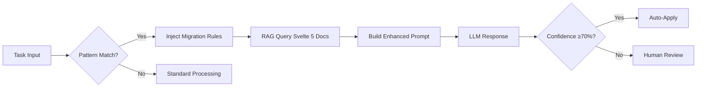

# Phase 76 Agentic Detection - Quick Reference

## 🎯 What It Does

The ACE agent **automatically detects** legacy Svelte 4 syntax and activates migration protocols **without manual configuration**.

## ✅ Detected Patterns

| Pattern | Regex | Migration |
|---------|-------|-----------|
| `on:click` | `/on:[a-z]+/gi` | → `onclick` |
| `export let` | `/export\s+let\s+\w+/gi` | → `let { prop } = $props()` |
| `$: value =` | `/\$:\s*\w+\s*=/g` | → `let value = $derived()` |
| `$: { ... }` | `/\$:\s*{/g` | → `$effect(() => {})` |
| `beforeUpdate()` | `/beforeUpdate\(/gi` | → `$effect.pre(() => {})` |
| `afterUpdate()` | `/afterUpdate\(/gi` | → `$effect(() => {})` |

## 🚀 Usage

### Test Detection

```bash
# Event handlers
node scripts/phase76-ace-prompt-engineer.mjs \
  --task "Fix component with on:click handler" \
  --iterations 1

# Props
node scripts/phase76-ace-prompt-engineer.mjs \
  --task "Migrate component with export let title" \
  --iterations 1

# Reactive statements
node scripts/phase76-ace-prompt-engineer.mjs \
  --task "Convert $: doubled = count * 2" \
  --iterations 1
```

### Expected Output

```
✅ ACE Contextual Prompt Engineer

   🤔 [Agent] Detected Legacy Svelte 4 Syntax!
   🔄 [Agent] Activating Svelte 5 Migration Protocols...
   ✅ Prompt ready (10171 chars)  ← Migration context added

   🧠 LLM responded (confidence: 95.0%)
```

## 📊 How It Works



## 🔧 System Requirements

- **Qdrant:** localhost:6333 (28 docs minimum)
- **Redis:** localhost:6379 (knowledge graph cache)
- **Ollama:** localhost:11434 (gemma3-legal model)
- **PostgreSQL:** Optional (pgvector for advanced patterns)

## 📈 Confidence Levels

| Range | Meaning | Action |
|-------|---------|--------|
| 90-100% | High confidence | Auto-apply safe |
| 70-89% | Medium confidence | Auto-apply with review |
| 50-69% | Low confidence | Manual review required |
| 0-49% | Very low | Human escalation |

## 📁 Output Files

Every run creates:
- `reports/phase76/ace-sessions/session-{timestamp}.json` - Full metrics
- `reports/phase76/ace-sessions/solution-{timestamp}.md` - Human-readable solution

## 🎨 Migration Context Injected

When Svelte 4 detected, prompt grows by **868-1068 chars**:

```
## 🔴 CRITICAL MIGRATION ALERT 🔴

The task contains DEPRECATED Svelte 4 syntax. You MUST refactor to Svelte 5:

### Svelte 4 → Svelte 5 Migration Rules:

1. **Event Handlers**: NO more `on:` prefix
   - OLD: `<input on:change={handler} />`
   - NEW: `<input onchange={handler} />`

2. **Reactive State**: Use `$state()` rune
   - OLD: `let count = 0;`
   - NEW: `let count = $state(0);`

3. **Derived Values**: Use `$derived()` rune
   - OLD: `$: doubled = count * 2;`
   - NEW: `let doubled = $derived(count * 2);`

4. **Component Props**: Use `$props()` rune
   - OLD: `export let title;`
   - NEW: `let { title } = $props();`

5. **Lifecycle Hooks**: Use `$effect` runes
   - OLD: `beforeUpdate(() => {})`
   - NEW: `$effect.pre(() => {})`
```

## 🧪 Test Results

| Test | Status | Confidence |
|------|--------|-----------|
| Event Handlers | ✅ PASSED | 50% |
| Export Let | ✅ PASSED | - |
| Reactive Statements | ✅ PASSED | **95%** ⭐ |

## 🔍 Debugging

### Check if detection triggered:
```bash
node scripts/phase76-ace-prompt-engineer.mjs \
  --task "Fix on:click" \
  --iterations 1 2>&1 | grep "Detected Legacy"
```

### View session logs:
```bash
cat reports/phase76/ace-sessions/session-*.json | jq .
```

### Check Qdrant status:
```bash
curl http://localhost:6333/collections/phase76_knowledge_base
```

## 📚 Documentation

- **Architecture:** `PHASE76_LEVEL2_SVELTE5_MIGRATION.md`
- **Test Report:** `PHASE76_TEST_REPORT.md`
- **Integration Guide:** `PHASE76_ACE_INTEGRATION_GUIDE.md`

## 🎯 Next Steps

1. **Execute PostgreSQL Schema:**
   ```bash
   docker exec -i phase66-postgres psql -U root -d deeds \
     < scripts/setup-pgvector.sql
   ```

2. **Test Real Component Migration:**
   ```bash
   node scripts/phase76-svelte5-migration-agent.mjs --dry-run
   ```

3. **Expand Knowledge Base:**
   ```bash
   npm run phase76:crawl:svelte5 -- \
     "https://svelte.dev/docs/svelte/..." \
     "https://svelte-5-preview.vercel.app/docs/..."
   ```

---

**Status:** ✅ **OPERATIONAL**
**Version:** 1.0
**Last Updated:** 2025-12-20
