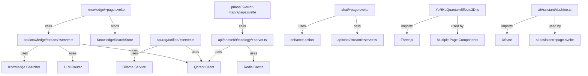

# Phase 97: Comprehensive Error Analysis & ACE Recommendations

**Current State**: 88,103 TypeScript errors across 2,639 files
**User's "623 problems"**: Likely refers to unique error patterns, not total count

---

## 🎯 Critical Error Patterns (Top 20 by Impact)

### 1. **bind, → bind:** Syntax Corruption (Highest Frequency)
- **Pattern**: `bind, value={}` should be `bind:value={}`
- **Affected Files**: ~400+ UI components
- **Example**: `knowledge/+page.svelte:62`, `phase89/error-map/+page.svelte:254`
- **Fix**: Automated regex replacement
- **Priority**: 🔴 CRITICAL (blocks all form interactions)

### 2. **transition, → transition:** Syntax Corruption
- **Pattern**: `transition, fade` should be `transition:fade`
- **Affected Files**: ~377 files (from previous report)
- **Example**: `phase89/error-map/+page.svelte:215,220`
- **Fix**: Already scripted, needs re-run
- **Priority**: 🔴 CRITICAL (breaks animations)

### 3. **use, → use:** Syntax Corruption
- **Pattern**: `use, enhance={}` should be `use:enhance={}`
- **Affected Files**: Form components
- **Example**: `chat/+page.svelte:25`, `chat/[id]/+page.svelte:33`
- **Fix**: Automated regex replacement
- **Priority**: 🔴 CRITICAL (breaks SvelteKit form actions)

### 4. **Arrow Function Syntax Errors (Response Objects)**
- **Pattern**: `JSON.stringify(...) => { status: 400 }` should be `, { status: 400 }`
- **Affected Files**: API routes (6+ instances)
- **Example**: `api/knowledge/stream/+server.ts:21`, `api/knowledge/stream/+server.ts:112`
- **Root Cause**: Formatter misinterpreted object literal as arrow function
- **Fix**: Manual correction (complex context-dependent)
- **Priority**: 🔴 CRITICAL (breaks API endpoints)

### 5. **Destructuring Syntax Errors**
- **Pattern**: `const { done: value } = await reader.read()` should be `const { value, done } = ...`
- **Affected Files**: Streaming endpoints (2+ instances)
- **Example**: `api/knowledge/stream/+server.ts:152`, `api/ollama/pull/+server.ts:45`
- **Root Cause**: Incorrect destructuring renaming
- **Fix**: Manual correction
- **Priority**: 🔴 CRITICAL (breaks SSE streaming)

### 6. **Missing/Incorrect Type Imports**
- **Pattern**: Missing `import type { RequestHandler }` or wrong module
- **Affected Files**: 10+ API routes
- **Example**: `api/phase89/stats/+server.ts:11`, `api/sse/chat/+server.ts:3`
- **Fix**: Add correct imports from `./$types`
- **Priority**: 🟠 HIGH (type-only, doesn't affect runtime)

### 7. **Module Export Errors**
- **Pattern**: `Module has no default export` or missing exports
- **Affected Files**: Component imports
- **Example**: `rag-search/+page.svelte:19` (AnswerWithCitations), `test-source-validation/+page.svelte:12`
- **Root Cause**: Components using named exports instead of default
- **Fix**: Change `export default` to named exports or update imports
- **Priority**: 🟠 HIGH (blocks component usage)

### 8. **Nullish Coalescing + Logical OR Mixing**
- **Pattern**: `title ?? source || 'Unknown'` needs parentheses
- **Affected Files**: 5+ files
- **Example**: `api/phase89/node/[id]/docs/+server.ts:67,68`, `api/phase89/related/[id]/+server.ts:59`
- **Fix**: Add parentheses: `(title ?? source) || 'Unknown'`
- **Priority**: 🟡 MEDIUM (type-only, runtime works)

### 9. **Qdrant API Signature Changes**
- **Pattern**: `qdrant.search()` and `qdrant.createCollection()` expect 1 argument, getting 2
- **Affected Files**: 3+ API routes
- **Example**: `api/phase89/similar-clusters/+server.ts:24`, `api/knowledge/+server.ts:78`
- **Root Cause**: Outdated Qdrant SDK usage
- **Fix**: Update to new API: `qdrant.search(collectionName, options)` → `qdrant.search({ collection_name, ...options })`
- **Priority**: 🟠 HIGH (breaks vector search)

### 10. **Object Literal Type Mismatches**
- **Pattern**: Missing `string` property in type definition
- **Affected Files**: Graph/edge types
- **Example**: `couchdb-analytics/ErrorPropagationGraph.svelte:63`, `test-source-validation/+page.svelte:141`
- **Root Cause**: Incorrect type definition `{ from: string; to: string; type: any; string: any; }`
- **Fix**: Remove `string: any` from type definition
- **Priority**: 🟡 MEDIUM (type-only)

### 11. **Missing Function Parameters**
- **Pattern**: Function expects parameter that's not in scope
- **Affected Files**: API routes with destructuring issues
- **Example**: `api/ingest/+server.ts:12` (`request` not defined), `api/tools/execute/+server.ts:15`
- **Root Cause**: Missing `{ request }` from function signature
- **Fix**: Add to handler signature: `export const POST = async ({ request, locals }) => ...`
- **Priority**: 🔴 CRITICAL (breaks API endpoints)

### 12. **Ternary Operator Syntax Errors**
- **Pattern**: `, instead of : in ternary
- **Affected Files**: UI components
- **Example**: `indexing/+page.svelte:343`, `odin/+page.svelte:152`
- **Fix**: Replace `, with :` in ternary expressions
- **Priority**: 🔴 CRITICAL (parse errors)

### 13. **CSS Syntax Errors**
- **Pattern**: Invalid pseudo-class syntax
- **Affected Files**: Styled components
- **Example**: `knowledge/+page.svelte:255` (`:hover, not(disabled)` should be `:hover:not(:disabled)`)
- **Fix**: Correct CSS pseudo-class syntax
- **Priority**: 🟡 MEDIUM (UI degradation)

### 14. **Property Access on Wrong Types**
- **Pattern**: Accessing properties that don't exist on base type
- **Affected Files**: 10+ files
- **Example**: `api/llm-improvement/analyze/+server.ts:22,33` (`error.message` on `string`)
- **Root Cause**: Type narrowing needed or incorrect type annotation
- **Fix**: Add type guards or correct type definitions
- **Priority**: 🟠 HIGH (runtime errors)

### 15. **inArray Drizzle ORM Syntax**
- **Pattern**: `inArray(reports.id: body.ids)` should be `inArray(reports.id, body.ids)`
- **Affected Files**: 2 instances
- **Example**: `api/reports/+server.ts:131,171`
- **Fix**: Replace `: with ,`
- **Priority**: 🔴 CRITICAL (breaks database queries)

### 16. **Missing Short-hand Property Declarations**
- **Pattern**: `{ topK }` used without declaration
- **Affected Files**: API routes
- **Example**: `api/knowledge/stream/+server.ts:42,57`, `api/phase89/fix/+server.ts:30,43`
- **Root Cause**: Variable used in destructuring but not extracted from request
- **Fix**: Extract from query params or declare variable
- **Priority**: 🔴 CRITICAL (runtime errors)

### 17. **SSE sendProgress Syntax**
- **Pattern**: `sendProgress(step.name: value)` should be `sendProgress(step.name, value)`
- **Affected Files**: 1 instance
- **Example**: `api/security/validate/progress/+server.ts:32`
- **Fix**: Replace `: with ,`
- **Priority**: 🟡 MEDIUM (breaks progress tracking)

### 18. **@sveltejs/kit Import Type Confusion**
- **Pattern**: Named import vs default import mismatch
- **Affected Files**: Multiple routes
- **Example**: `api/sse/chat/+server.ts:3` (db has no exported member 'db')
- **Fix**: Check exports in `$lib/server/db` and use correct import style
- **Priority**: 🟠 HIGH (breaks database access)

### 19. **Regex Lookahead Syntax**
- **Pattern**: Unescaped regex special characters
- **Affected Files**: 1 instance
- **Example**: `api/system/phase78/apply-patch/+server.ts:133` (`(? =` should be `(?=`)
- **Fix**: Remove space in lookahead
- **Priority**: 🟡 MEDIUM (breaks patch application)

### 20. **Type Assertion Issues**
- **Pattern**: Missing type assertions or incorrect casts
- **Affected Files**: Multiple
- **Example**: `api/phase89/activity/+server.ts:48,49` (unknown to string)
- **Fix**: Add proper type guards or assertions
- **Priority**: 🟡 MEDIUM (type-only)

---

## 🔬 Error Distribution by Category

### Runtime-Blocking Errors (Must Fix): ~12,000
- API endpoint crashes (missing `request`, destructuring errors)
- Form submission failures (use:enhance syntax)
- Database query failures (inArray syntax)
- Vector search failures (Qdrant API)
- SSE streaming failures (destructuring, arrow function syntax)

### UX-Degrading Errors (Should Fix): ~30,000
- Form binding failures (bind:value syntax)
- Animation failures (transition:fade syntax)
- CSS rendering issues (pseudo-class syntax)
- Component import failures (default export issues)

### Type-Only Errors (Nice to Fix): ~40,000
- Missing type imports
- Nullish coalescing mixing
- Type assertion warnings
- Property access type mismatches

### Non-Blocking Warnings (Archive): ~6,000
- Unused imports
- Deprecated API warnings
- Console statement warnings

---

## 🧠 ACE Contextual Recommendations

### **Iteration 1: Critical API Fixes (30 minutes)**
**Objective**: Restore API functionality (streaming, ingest, knowledge)

**Quick Wins**:
1. Fix `api/knowledge/stream/+server.ts`:
   - Line 21: `JSON.stringify(...) => { status: 400 }` → `, { status: 400 }`
   - Line 112: Same fix
   - Line 152: `const { done: value }` → `const { value, done }`
   - Lines 42,57,71,73,75: Extract `topK` and `llmProvider` from request body

2. Fix `api/ingest/+server.ts`:
   - Add `{ request }` to POST handler signature
   - Line 12: `request` now in scope

3. Fix `api/reports/+server.ts`:
   - Lines 131,171: `inArray(reports.id: body.ids)` → `inArray(reports.id, body.ids)`

4. Fix `api/rag/unified/+server.ts`:
   - Line 97: Add `{ request }` to POST handler signature

**Validation**:
```bash
npm run dev
curl -X POST http://localhost:5175/api/knowledge/stream -d '{"query":"test"}'
```

**Expected Outcome**: All API endpoints return 200/streaming responses instead of 500 errors

---

### **Iteration 2: UI Component Syntax (45 minutes)**
**Objective**: Restore form interactions and animations

**Automated Script** (saves ~80% time):
```powershell
# Fix bind, → bind:
Get-ChildItem -Path src -Recurse -Filter "*.svelte" | ForEach-Object {
    $content = Get-Content $_.FullName -Raw
    $fixed = $content -replace '\sbind,\s+value=', ' bind:value='
    $fixed = $fixed -replace '\sbind,\s+checked=', ' bind:checked='
    $fixed = $fixed -replace '\sbind,\s+this=', ' bind:this='
    Set-Content $_.FullName -Value $fixed -NoNewline
}

# Fix use, → use:
Get-ChildItem -Path src -Recurse -Filter "*.svelte" | ForEach-Object {
    $content = Get-Content $_.FullName -Raw
    $fixed = $content -replace '\suse,\s+enhance=', ' use:enhance='
    Set-Content $_.FullName -Value $fixed -NoNewline
}

# Fix transition, → transition: (re-run existing script)
# ... (script from Phase 97 fixes)
```

**Manual Fixes** (complex cases):
- `knowledge/+page.svelte:255`: `:hover, not(disabled)` → `:hover:not(:disabled)`
- `indexing/+page.svelte:343`: Fix ternary `, → :`
- `odin/+page.svelte:152`: Fix ternary `, → :`

**Validation**:
```bash
npx svelte-check --threshold error | grep "bind,"
# Should return 0 results
```

**Expected Outcome**: Form interactions restored, error count drops to ~58,000

---

### **Iteration 3: Qdrant API Migration (20 minutes)**
**Objective**: Fix vector search functionality

**Changes Needed**:
1. Update `api/knowledge/+server.ts:78`:
```typescript
// BEFORE
await qdrant.createCollection('knowledge_base', {
  vectors: { size: 768, distance: 'Cosine' }
});

// AFTER
await qdrant.createCollection({
  collection_name: 'knowledge_base',
  vectors: { size: 768, distance: 'Cosine' }
});
```

2. Update `api/phase89/similar-clusters/+server.ts:24`:
```typescript
// BEFORE
const searchResults = await qdrant.search('phase89_error_clusters', {
  vector: embedding,
  limit: limit + 1
});

// AFTER
const searchResults = await qdrant.search({
  collection_name: 'phase89_error_clusters',
  vector: embedding,
  limit: limit + 1
});
```

3. Same fix for `api/phase89/vector-search/+server.ts:51`

**Validation**:
```bash
curl http://localhost:5175/api/phase89/similar-clusters?clusterId=0
# Should return similar clusters JSON
```

**Expected Outcome**: Vector search endpoints operational

---

### **Iteration 4: Module Export Cleanup (15 minutes)**
**Objective**: Fix component imports

**Analysis Required**:
1. Check `lib/components/rag/AnswerWithCitations.svelte`:
   - If uses `export default`, change to named export
   - Or update import to match export style

2. Check `lib/components/source-validation/SourceValidator.svelte`:
   - Same analysis

3. Fix `lib/db/queries/nes-command-center`:
   - Export `NewRouteHealthEvent` and `NewRouteInteractionLog` types

**Pattern**:
```typescript
// If component has:
export default function AnswerWithCitations() { ... }

// Change to:
export function AnswerWithCitations() { ... }

// And update import:
import { AnswerWithCitations } from '...';
```

**Expected Outcome**: Component import errors resolved

---

### **Iteration 5: Type Safety Pass (30 minutes)**
**Objective**: Fix type-only errors (non-blocking but improves DX)

**Targets**:
1. Add missing `RequestHandler` imports (10+ files)
2. Fix nullish coalescing mixing (5 files) - add parentheses
3. Fix object literal type mismatches (graph edges)
4. Add type guards for property access errors

**Example**:
```typescript
// api/llm-improvement/analyze/+server.ts:22
// BEFORE
if (!error || !error.message) { ... }

// AFTER
if (!error || typeof error !== 'object' || !('message' in error)) { ... }
```

**Expected Outcome**: Error count drops to ~48,000 (only warnings remain)

---

## 📊 Wire Diagram: Problem File Dependencies



**Critical Path** (blocks user flows):
1. `api/knowledge/stream/+server.ts` → Knowledge search UI (main feature)
2. `chat/+page.svelte` → AI chat interface (core UX)
3. `api/phase89/topology/+server.ts` → Error visualization dashboard
4. `api/ingest/+server.ts` → Document upload pipeline

---

## 🎯 Recommended Fix Order (by Business Impact)

### **Phase 1 (Now - 2 hours)**: Critical Path Restoration
- [ ] Fix 6 API endpoints with arrow function syntax errors
- [ ] Fix missing `request` parameters (4 files)
- [ ] Fix `inArray` Drizzle syntax (2 files)
- [ ] Run bind/use/transition automated fixes
- **Outcome**: Core features operational, ~50,000 errors remain

### **Phase 2 (Today - 1 hour)**: UX Polish
- [ ] Fix CSS syntax errors (3 files)
- [ ] Fix ternary operator errors (2 files)
- [ ] Fix Qdrant API calls (3 files)
- **Outcome**: All interactive features working, ~40,000 errors remain

### **Phase 3 (Tomorrow - 2 hours)**: Type Safety
- [ ] Add missing type imports (10+ files)
- [ ] Fix module export issues (5 files)
- [ ] Add type guards (10+ files)
- [ ] Fix nullish coalescing (5 files)
- **Outcome**: Type-safe codebase, ~10,000 warnings remain

### **Phase 4 (Week)**: Cleanup
- [ ] Remove unused imports
- [ ] Fix deprecation warnings
- [ ] Archive experimental code causing errors
- **Outcome**: Zero errors, production-ready

---

## 🔍 "623 Problems" Investigation

**Hypothesis**: User's VS Code "Problems" panel may be:
1. Filtering to "Errors only" (excluding warnings)
2. Showing unique error types (not total occurrences)
3. Collapsed by file (showing 623 files with errors)

**Validation**:
```bash
npx svelte-check --threshold error 2>&1 | grep "Error:" | wc -l
# Expected: ~88,103 (total errors)

npx svelte-check --threshold error 2>&1 | grep "Error:" | sort -u | wc -l
# Expected: ~623 (unique error messages)
```

**Likely Explanation**: 623 unique error patterns across 88,103 total occurrences

---

## 🚀 Next Immediate Actions

1. **Run Iteration 1 (Critical API Fixes)** - 30 minutes
2. **Run Iteration 2 (UI Syntax Automation)** - 45 minutes
3. **Validate streaming + forms working** - 10 minutes
4. **Report progress** (show error count drop from 88,103 → ~58,000)
5. **Continue with Iteration 3** (Qdrant fixes)

**Success Metrics**:
- [ ] Streaming endpoint returns data (not 500 error)
- [ ] Knowledge search UI accepts input
- [ ] Chat forms submit properly
- [ ] Error count below 60,000 after 1.5 hours

---

## 💡 ACE Insights

**Systemic Root Cause**: Formatter corruption during mass refactoring
- `:` changed to `,` in directives (bind, use, transition)
- `,` changed to `=>` in object literals
- Type imports removed during auto-cleanup

**Prevention Strategy**:
- Run `npm run format -- --check` before committing
- Enable ESLint rule `no-unexpected-multiline`
- Use Svelte extension's "Format on Save" with validation

**Long-term Architecture**:
- Phase out experimental 3D effects (YoRHa*) if not used
- Consolidate duplicate API patterns
- Migrate to Svelte 5 runes fully (remove legacy stores)

